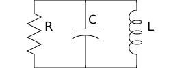

SVG Schematic
=============

| Version: 0.3.0
| Released: 2018-02-21
|

This package allows you to create simple SVG schematics. It was created with 
desire to be able to include simple schematics into Latex Beamer presenations.  
Latex has a similar package called `Circuitikz 
<`http://texdoc.net/texmf-dist/doc/latex/circuitikz/circuitikzmanual.pdf>`_, and 
while it is powerful and flexible and creates beautiful schematics, I found it 
to also be confusing and poorly documented and somewhat buggy. I gave up on 
circuititk when I could not flip a polarized capacitor (there is no builtin 
capability to do this basic operation, and instead you are expected to scale the 
X or Y dimension by -1, but that would also flip the component into the negative 
quadrant).  The other issue is that I could not draw schematics that contained 
three terminal components using purely vertical or horizontal lines.

Installation
------------

Requires Python3. Works best with Python3.6 or newer.

If you just wish to install without download the source code, do this::

    pip3 install --user --upgrade svg_schematic

The source code is hosted on `GitHub 
<https://github.com/KenKundert/svg_schematic>`_. Please go there to ask 
questions, post issue and pull requests.

To download the source and install, do the following::

    git clone https://github.com/KenKundert/svg_schematic.git
    cd svg_schematic
    pip3 install --user --upgrade .

You can also find several `examples 
<https://github.com/KenKundert/svg_schematic/tree/master/examples>`_ there as 
well.

Introduction
------------

With *schematic* you simply place components at specific coordinates, and then 
place wires to connect them together. For example:

.. code-block:: python

    from schematic import Schematic, Resistor, Capacitor, Inductor, Wire

    # x coordinates
    r_x = 0
    c_x = r_x + 75
    l_x = c_x + 75

    # y coordinates
    top = 0
    mid = 50
    bot = 100

    # open schematic
    schematic = Schematic(filename = "rlc.svg")

    # add wires (these should be first)
    Wire([(r_x, top), (l_x, top), (l_x, bot), (r_x, bot)])
    Wire([(c_x, top), (c_x, bot)])

    # add components
    Resistor((r_x, mid), name='R', orientation='v')
    Capacitor((c_x, mid), name='C', orientation='v')
    Inductor((l_x, mid), name='L', orientation='v')

    # close schematic and write the SVG file
    schematic.close()

It would create the following schematic:

You can also use *schematic* with the Python *with* statement, which will 
automatically close and save the schematic. Thus the second half the above 
example becomes:

.. code-block:: python

    with Schematic(filename = "rlc.svg"):
        Wire([(r_x, top), (l_x, top), (l_x, bot), (r_x, bot)])
        Wire([(c_x, top), (c_x, bot)])
        Resistor((r_x, mid), name='R', orientation='v')
        Capacitor((c_x, mid), name='C', orientation='v')
        Inductor((l_x, mid), name='L', orientation='v')

There are a few things to note.

#.  SVG coordinates are used, which inverts the y axis (more southern 
    coordinates are more positive the more northern coordinates).
#.  Components are placed in invisible tiles. When you specify the position of 
    the component you are specifying the center of the tile.
#.  Wires and components stack in layers, with the first that is placed going on 
    the lowest layer.  Most components contain concealers, which are small rectangles that are designed 
    to conceal any wires that run underneath the components. This allows you to 
    simply run a wire underneath the component rather than explicitly wire to 
    each terminal, which can simply the description of the schematics. For this 
    to work, the wire must be specified before the component as done in the 
    above example. Also, the color of the concealers matches that of the 
    background, so if you use no background, then you also lose the concealers.
#.  The unit size of a tile is 50. You have limited ability to specify the size 
    of some components, and specifying the size as 1 implies the tile will be 
    50x50.  Most components have a size of 2 and so sit within a 100x100 tile.
#.  You need not specify the size as an integer.
#.  It is generally better to specify the important feature location coordinates 
    in variables, and use the variable to control the location of the component, 
    rather than specifying the coordinates directly on the components and wires.  
    Further, it generally good to specify the coordinates in terms of the 
    previous coordinates. In this way, you can adjust the placement of many 
    features by changing one or two variable values.
#.  You can flip and rotate the components using the *orientation* argument.
    Specifying 'v' implies a vertical placement, and 'h' a horizontal placement 
    (a component is converted from vertical to horizontal with a -90 degree 
    rotation.  Specifying `|` implies the component should be flipped along 
    a vertical axis (left to right) and specifying '-' implies the component 
    should be flipped along a horizontal axis (up to down).
#.  With most components you can specify a name, and with many components you 
    can also specify a value.  The text orientation will always be horizontal 
    regardless of the component orientation.
#.  When the schematic is used with Latex, you can use Latex formatting in the 
    name and value. For example, you can specify: `name='$L_1$'`. You should use 
    raw strings if your string contains backslashes: `value=r'$10 \\mu H$'`.
#.  Components provide the *t* attribute, which is a list of the locations of 
    its terminals. Many component also provide individual attributes for each 
    terminal. For example, the resistor, capacitor, and inductor components 
    provide the *p* and *n* terminal attributes. The MOS component provides the 
    *d*, *g*, and *s* terminal attributes. The diode component provides the *a* 
    and *c* terminal attributes.
#.  Components contain attributes for each of the 9 principal coordinates (c, n, 
    ne, e, se, s, sw, w, nw).  For most components, these are the principal 
    coordinates for the component's tile. However, the source places its 
    principal coordinates on the circle used to depict the source.

Placement Strategies
~~~~~~~~~~~~~~~~~~~~

There are two basic approaches to placing components. First, you may specify the 
coordinate in absolute terms. For example::

    with Schematic(filename = "rlc.svg"):
        Wire([(-75, -50), (75, -50), (75, 50), (-75, 50)])
        Wire([(0, -50), (0, 50)])
        Resistor((-75, 0), name='R', orientation='v')
        Capacitor((0, 0), name='C', orientation='v')
        Inductor((75, 0), name='L', orientation='v')

This turns out to be rather cumbersome if you need to move things around. In 
that case you likely have to adjust a large number coordinates.  Since 
schematics of any complexity are often adjusted repeatedly before they are 
correct and aesthetically appealing, this approach can lead to a lot of tedious 
work.

A variation on this approach that is considerably better is to place the 
coordinates in variables and then use the variables when specifying component 
locations and wire vertices.  That approach was used in the first example.  It 
can results in the up-front specification of a large number of coordinates.  
A refinement is to just specify the primary coordinates up-front, and calculate 
the rest as needed::

    r_x, r_y = 0, 0
    c_x, c_y = r_x + 75, r_y
    l_x, l_y = c_x + 75, c_y

    with Schematic(filename = "rlc.svg"):
        Wire([(r_x, c_y-50), (l_x, c_y-50), (l_x, c_y+50), (r_x, c_y+50)])
        Wire([(c_x, c_y-50), (c_x, c_y+50)])
        Resistor((r_x, 0), name='R', orientation='v')
        Capacitor((c_x, 0), name='C', orientation='v')
        Inductor((l_x, 0), name='L', orientation='v')

*Schematic* provides a way for you to generated these coordinates relatively 
efficiently by using offsets::

    # create coordinates
    x_offsets = dict(
        r = 0,
        c = 75,
        l = 75,
    )
    y_offsets = dict(
        top = 0,
        mid = 50,
        bot = 50,
    )
    offsets_to_coordinates(locals(), x_offsets, y_offsets)

*offsets_to_coordinates* creates a collection of local variables whose names 
derive from the keys used in the dictionary. This example creates the following 
local variables::

    r_x = 0
    c_x = 75
    l_x = 150
    top_y = 0
    mid_y = 50
    bot_y = 100

The *x_offsets* are handled as follows. The process starts at 0. The first 
offset, *r*, is 0, meaning that *r_x* will be 0 units east of 0, which of course 
is 0. Then *c_x* will be 75 units east of *r_x* and *l_x* is 75 units east of 
*c_x*. *y_offsets* is processed in a similar way, except the direction of travel 
is south. This function assumes that the dictionary is ordered, as such it 
requires Python3.6 or greater. If you are not using such a recent version of 
Python, the you should import *OrderedDict* from *collections* and use it to 
build the dictionary.

The second basic approach to placing component is to place them relative to each 
other. To do so, you would generally take advantage of the fact that components 
have attributes that contains useful coordinate locations on the component. For 
example::

    r = Resistor((0, 0), name='R', orientation='v')

Now, *r.c*, *r.n*, *r.ne*, *r.e*, *r.se*, *r.s*, *r.sw*, *r.w*, and *r.nw* 
contain the coordinates of the center, north, northeast, east, southeast, south, 
southwest, west, and northwest corners.  In addition, *r.p* and *r.n* hold the 
coordinates of the positive and negative terminals, as do *r.t[0]* and *r.t[1]*.
Finally, wires provide the *b* and *e* attributes, which contain the coordinates 
of their beginning and ending.

The *shift*, *shift_x*, and *shift_y* utility functions are provided to shift 
the position of a coordinate pair.  Examples::

    shift((x,y), dx, dy) --> (x+dx, y+dy)
    shift_x((x,y), dx) --> (x+dx, y)
    shift_y((x,y), dy) --> (x, y+dy)

You can also use *with_x* and *with_y* to replace the *x* or *y* portion of 
a coordinate pair. They take two arguments, the first is returned with the 
appropriate coordinate component replaced by the second. The second argument may 
be a simple number or it may be a coordinate pair, in which case the appropriate 
coordinate component is used to replace the corresponding component in the first 
argument::

    with_x((x1,y1), x2) --> (x2, y1)
    with_y((x1,y1), y2) --> (x1, y2)
    with_x((x1,y1), (x2,y2)) --> (x2, y1)
    with_y((x1,y1), (x2,y2)) --> (x1, y2)

Now the RLC schematic can be rewritten as follows::

    with Schematic(filename = "rlc.svg"):
        r = Resistor((0, 0), name='R', orientation='v')
        c = Capacitor(shift_x(r.c, 75), name='C', orientation='v')
        l = Inductor(shift_x(c.c, 75), name='L', orientation='v')
        Wire([r.p, c.p, l.p])
        Wire([r.n, c.n, l.n])

In this case the only coordinate that was explicitly specified with that of *r* 
which was placed at the origin. All other components and wires were placed 
relative to the center of *r*.

You are free to mix these various styles of component placement as you desire.

SVGwrite
~~~~~~~~

*Schematic* subclasses the Python `svgwrite 
<https://pythonhosted.org/svgwrite>`_  *Drawing* class. So you can call any 
*Drawing* method from a schematic. In this case you must keep the schematic 
instance to access the methods::

    with Schematic(filename = "rlc.svg") as schematic:
        schematic.circle(
            center=(0,0), r=100, fill='none', stroke_width=1, stroke='black'
        )
        schematic.text(
            'Hello', insert=(0,0), font_family='sans', font_size=16, fill='black'
        )

One thing to note is that *Schematic* normally keeps track of the location and 
extent of the schematic objects and sizes the drawing accordingly. It will be 
unaware of anything added directly to the drawing though the *svgwrite* methods.
As a result, these objects may fall partially or completely outside the bounds 
of the drawing. You can add padding when you first instantiate *Schematic* or 
you can use the *svgwrite* *viewbox* method to extend the bounds.

Latex
~~~~~

To include these schematics into Latex documents, you need to run `Inkscape 
<https://inkscape.org>`_  with the --export-latex command line option to 
generate the files that you can include in Latex. Here is a Makefile that you 
can use to keep all these files up to date::

    DRAWINGS = \
        flash-adc \
        pipeline-adc \
        delta-sigma-adc

    SVG_FILES=$(DRAWINGS:=.svg)
    PDF_FILES=$(DRAWINGS:=.pdf)
    PDFTEX_FILES=$(DRAWINGS:=.pdf_tex)

    .PHONY: clean
    .PRECIOUS: %.svg

    %.svg: %.py
            python3 $<

    %.pdf: %.svg
            inkscape -z -D --file=$< --export-pdf=$@ --export-latex

    clean:
            rm -rf $(PDF_FILES) $(PDFTEX_FILES) __pycache__

To include the files into your Latex document, use::

    \def\svgwidth{0.5\columnwidth}
    \input{delta-sigma.pdf_tex}

Finally, to convert your Latex file to PDF, use::

    pdflatex --shell-escape converters.tex

Other Image Formats
~~~~~~~~~~~~~~~~~~~

You can use Image Magick package to convert SVG files to other image formats.  
For example::

    convert receiver.svg receiver.png

Schematic
---------

When creating a schematic you may specify the following arguments: filename, 
font_size, font_family (ex. 'serif' or 'sans-serif'), line_width, and 
dot_radius.  The dot radius is the radius of solder-dots and pins.

You can also specify background and outline, both of which are colors. The 
default background is 'white' and the default outline is 'none'. If you set 
background to 'none' be aware that this makes the concealers transparent, 
meaning that you cannot wire under components, instead you must wire to the 
pins.  It is common to start by setting outline to allow you to see the SVG 
drawing area, and then later remove it when your schematic is complete.
pad arguments are used to adjust the size of the SVG 

The size of the SVG canvas is automatically sized to fit tightly around the 
specified schematic objects. You might find that the text associated with input 
and output pins has a tendency to extend beyond the canvas. This is because no 
attempt is made to estimate the width of text. Instead, you can increase the 
width of the pin's tile using its *w* parameter. In addition, you can also add 
padding when creating the schematic. There are five padding arguments. The most 
commonly used is *pad*, which simply adds the same padding to all four edges. In 
addtion, you can control the individual edges using left_pad, right_pad, 
top_pad, and bottom_pad. These simply add to pad to create the final padding for 
each edge.

Wire
----

Draw a wire between two or more points given in sequence. Each point should be 
specified as a x,y pair. Wires are often specified before components, which 
places them on the lowest level, allowing the component to obscure the wires 
when needed.  Example:

.. code-block:: python

    Wire([(x0,y0), (x1,y1), (x2,y2), (x3,y3)])

*Wire* supports the *kind* argument, which may be either `plain`, `|-`, `-|`, 
`|-|`, or `-|-`.  With plain, any-angle line segments are added between each of 
the points.  With `|-`, `-|`, `|-|`, and `-|-` the wires are constrained to 
follow a Manhattan geometry (between each point there may be one, two, or three 
line segments that are constrained to be either purely vertical or purely 
horizontal.  With `|-` there are two segments, with the first being vertical.  
With `-|`, there are also two segments, but the first is horizontal. With `|-|`, 
and `-|-` there there are three segments with the middle segment being half way 
between the two points. With `|-|`, the segments are vertical, horizontal, and 
vertical.  With `-|-`, the segments are horizontal, vertical, and horizontal.

*Wire* also supports the *line_width*  and *color* arguments.

*Wire* provides the *b* and *e* attributes, that contain the coordinates of the 
beginning and end of the wire.

Components
----------

This section documents the available components. Components include an invisible 
tile in which the component should fit. The tile extent is used when determining 
the size of the overall schematic.  Each component requires that you specify 
location by giving the coordinates of the center point of its tile. You can also 
generally specify the *orientation*, the *name*, the *value*, and a *nudge*.

The *orientation* generally consists of either 'v' or 'h', indicating that 
a vertical or horizontal orientation is desired, but may include '|' and '-', 
indicating that the component should be flipped around either the vertical or 
horizontal axis. The *name* and *value* are strings that are added to the 
component as labels, though not all components will display the *value*. The 
*nudge* is a number that adjusts the placement of labels to avoid wires.

In addition, some components support other arguments, such as *kind* or *loc*.

You may pass wires directly under most components.  The component will conceal 
the wire in those places where it should not be shown. This makes it simpler to 
wire up a schematic as you don't need separate wires between a string of 
components that all fall in a line. Rather, you would just specify the wire 
first, and then it will run underneath the components.  This trick works as lone 
as long as you do not specify the schematic background as 'none'.

Components have a *t* attribute that contains the coordinates of the terminals.  
It is an array that tends to follow several conventions, the SPICE order and 
outputs first. If there is a pair of terminals, the top or right would be given 
first.  In addition, select components place their terminal locations into named 
attributes.

Resistor
~~~~~~~~

Draw a resistor.

.. code-block:: python

    Resistor((x,y), orientation='v', name=R1, value='50Ω')

You may pass a wire directly under the resistor and the wire will be concealed 
by the resistor.

The *p* and *n* attributes contain the coordinates of the positive and negative 
terminals.

Capacitor
~~~~~~~~~

Draw a capacitor. You must specify the location of the center as an x,y pair.  
You may also specify the orientation, the name, and the value.

.. code-block:: python

    Capacitor((x,y), orientation='h', name=C1, value='1.2pF')

You may pass a wire directly under the capacitor and the wire will be concealed 
by the capacitor.  The capacitor is polarized with reference end being terminal 
1.

The *p* and *n* attributes contain the coordinates of the positive and negative 
terminals.

Inductor
~~~~~~~~

Draw an inductor. You must specify the location of the center as an x,y pair.  
You may also specify the orientation, the name, the value, and the nudge.

.. code-block:: python

    Inductor((x,y), orientation='h', name=L1, value='1μH')

You may pass a wire directly under the inductor and the wire will be concealed 
by the inductor.

The *p* and *n* attributes contain the coordinates of the positive and negative 
terminals.

Diode
~~~~~

Draw a diode. You must specify the location of the center as an x,y pair.  You 
You may also specify the orientation, the name, the value, and the nudge.

.. code-block:: python

    Inductor((x,y), orientation='h', name=L1, value='1μH')

You may pass a wire directly under the inductor and the wire will be concealed 
by the inductor. The anode is terminal 0 and the cathode is terminal 1.

The *a* and *c* attributes contain the coordinates of the anode and cathode 
terminals.

MOS
~~~

Draw a MOSFET. You must specify the location of the center as an x,y pair.  You 
may also specify the kind, the orientation, the name, and the value. The kind 
can either be 'n' or 'p'.

.. code-block:: python

    MOS((x,y), kind='n', orientation='v|', name=M2, value='10')

You may pass a wire directly under the FET and the wire will be concealed by the 
FET.

The *d*, *g* and *s* attributes contain the coordinates of the drain, gate and 
source terminals.

AMP
~~~

Draw an amplifier. You must specify the location of the center as an x,y pair.  
You may also specify the kind, the orientation, the name, and the value. The 
kind can either be 'se', 'oa' or 'de': 'se' is short for single-ended and has no 
label on the input pin, 'oa' is short for operational amplifier and has markings 
for the positive and negative inputs, and 'da' is short for differential 
amplifier and has markings for positive and negative inputs and outputs.

.. code-block:: python

    Amp((x,y), kind='da', orientation='h-')

You may pass a wire or wires directly under the amplifier and the wire will be 
concealed by the amplifier.

Gate
~~~~

Draw a gate. You must specify the location of the center as an x,y pair.  You 
may also specify the kind, the orientation, the name, and the value.  Currently 
the only supported kind of gate is 'inv', an inverter.

.. code-block:: python

    Gate((x,y), kind='inv')

You may pass a wire or wires directly under the amplifier and the wire will be 
concealed by the gate.

Source
~~~~~~

Draw a source. You must specify the location of the center as an x,y pair.  You 
may also specify the kind, the orientation, the name, and the value. The kind 
can either be 'empty', 'vdc', 'idc', 'sine', 'sum', or 'mult'.

.. code-block:: python

    Source((x,y), kind='sine', name='Vin')

You may pass a wire or wires directly under the source and the wire will be 
concealed by the source.

The component also includes the nine principal coordinates for the source: c, n, 
ne, e, se, s, sw, w, and nw. Except for c, they are evenly distributed around 
the circle.

Switch
~~~~~~

Draw an switch. You must specify the location of the center as an x,y pair.  You 
may also specify the kind, the orientation, the name, and the value. The kind 
can either be 'spst' or 'spdt'.

.. code-block:: python

    Switch((x,y), kind='spst', name='φ₁')

You may pass a wire or wires directly under the switch and the wire will be 
concealed by the switch.

Box
~~~

Draw a box. You must specify the location of the center as an x,y pair.  You may 
also specify the orientation, the name, the value, the width (w), the height 
(h), and background, an override for the color used of the interior of the box.  
The default width is 2 and the default height is 1.5.

.. code-block:: python

    Box((x,y), name='$z^{-1}$', w=1, h=1)

You may pass a wire or wires directly under the box and the wire will be 
concealed by the box.

*Box* also supports the *line_width* and *background* arguments.

The component also includes the nine principal coordinates for the box: c, n, 
ne, e, se, s, sw, w, and nw. Except for c, they are evenly distributed around 
the box.

Ground
~~~~~~

Draw a ground. You must specify the location of the center as an x,y pair.  The 
center of the tile corresponds to the top of the ground symbol. You may also 
specify the kind, the orientation, the name, and the value, but the value is 
currently unused.

.. code-block:: python

    Ground((x,y))

Pin
~~~

Draw a pin (a small hollow circle). You must specify the location of the center 
as an x,y pair.  You may also specify the kind, the orientation, the name, the 
value, and the size.  The kind can either be 'in', 'out', 'dot', or 'none'.  
With 'in' pins, the labels go on the left, with 'out' pins they go on the right.
By default the size of the pin is 1, meaning that a unit sized tile is used.  
This is significant if the label is at the edge of the schematic. If the labels 
extend beyond the tile, they may extend beyond the computed viewbox for the 
schematic.  You can fix this by specifying a larger size.

.. code-block:: python

    Pin((x,y), kind='out', name='Vout', size=2)

You may pass a wire or wires directly under the pin and the wire will be 
concealed by the pin.

Dot
~~~

Draw a solder dot (a small filled circle). Dot is just an alias for Pin, except 
that the default kind is 'dot'.

.. code-block:: python

    Dot((x,y))

Label
~~~~~

Place a label. You must specify the location of the text anchor as an x,y pair.  
You may also specify the location (loc), the name (the label), the width (w) and 
the height (h).  The location can be 'c', 'n', 'ne', 'e', 'se', 's', 'sw', 'w', 
and 'nw'. The default width and height is 1.

.. code-block:: python

    Label((x,y), name='$z^{-1}$', w=1, h=1)

You can also specify the kind and orientation arguments. The kind may be 
'plain', 'arrow', 'slash' or 'dot'. If 'plain' is specified, no symbol is added, 
only the name is displayed. If 'arrow' is specified, an arrow is added.  If 
'slash' is specified, a small slash is added through the center.  It is 
generally used with buses to indicate the bus width. Finally, 'dot' adds 
a solder dot.

