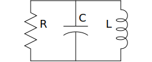
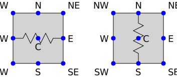
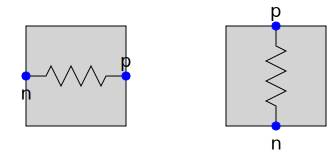
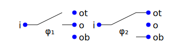
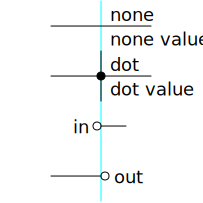
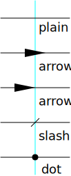

SVG Schematic
=============

| Version: 0.6.0
| Released: 2019-09-03
|

This package allows you to create simple SVG schematics. It was created with 
desire to be able to include simple schematics into Latex Beamer presentations.  
Latex has a similar package called `Circuitikz 
<`http://texdoc.net/texmf-dist/doc/latex/circuitikz/circuitikzmanual.pdf>`_, and 
while it is powerful and flexible and creates beautiful schematics, I found it 
to also be confusing and poorly documented and somewhat buggy. I gave up on 
circuititk when I could not flip a polarized capacitor (there is no builtin 
capability to do this basic operation, and instead you are expected to scale the 
X or Y dimension by -1, but that would also flip the component into the negative 
quadrant).  The other issue is that I could not draw schematics that contained 
three terminal components using purely vertical or horizontal lines.

Installation
------------

Requires Python3. Works best with Python3.6 or newer.

If you just wish to install without downloading the source code, do this::

    pip3 install --user --upgrade svg_schematic

The source code is hosted on `GitHub 
<https://github.com/KenKundert/svg_schematic>`_. Please go there to ask 
questions, post issue and pull requests.

To download the source and install, do the following::

    git clone https://github.com/KenKundert/svg_schematic.git
    cd svg_schematic
    pip3 install --user --upgrade .

You can also find several `examples 
<https://github.com/KenKundert/svg_schematic/tree/master/examples>`_ there as 
well.

The current version is not compatible with *svg_schematic* version 0.6.

Introduction
------------

With *svg_schematic* you simply pick one symbol and place it at the origin and 
then place the other symbols relative to the ones previously placed.  For 
example:

.. code-block:: python

    from svg_schematic import Schematic, Resistor, Capacitor, Inductor, Wire
    from inform import Error, error, os_error

    try:
        with Schematic(filename='rlc.svg'):
            r = Resistor(name='R', orient='v')
            c = Capacitor(C=r.C, xoff=75, name='C', orient='v')
            l = Inductor(C=c.C, xoff=75, name='L', orient='v')
            Wire([r.p, l.p])
            Wire([r.n, l.n])
    except Error as e:
        e.report()
    except OSError as e:
        error(os_error(e))

When run, it produces the following schematic:

Component Placement
~~~~~~~~~~~~~~~~~~~

In this example the resistor is placed without a location, and so its center is 
placed at the origin, (0, 0).  You can then access the location of the center of 
the resistor using ``r.C``, which is a XY-pair. That is passed to the capacitor 
using `C=r.C` with an extra parameter of ``xoff=75``, meaning the center of the 
capacitor is horizontally offset by 75 units from center of the resistor.  To 
give you a sense of how far 75 units is, the length of the resistor is 100 
units.  Positive horizontal offsets shift the location to the right, positive 
vertical offsets shift the location down.  Finally, the inductor is placed 75 
units to the right of the capacitor.

When specifying offsets, you can specify the x-offset using ``xoff``, the 
y-offset using ``yoff``, and you can specify both with ``off`` as a tuple. For 
example, ``off=(50,25)`` is equivalent to ``xoff=50, yoff=25``.

Wires are added using an list of points, where each point is an XY-pair. In the 
simplest case, a line is run between each of the point specified.  Thus, the 
first wire runs from ``r.p`` to ``l.p``, where ``r`` is the resistor and ``r.p`` 
is the location of the ``p`` terminal of the resistor.  ``l.p`` is the location 
of the positive terminal of the inductor.  The second wire connects the negative 
pins.

Principle Coordinates
~~~~~~~~~~~~~~~~~~~~~

Each component is embedded in a tile, and each tile has 9 principle coordinate 
named C, N, NE, E, SE, S, SW, W, and NW which are short for center, north, 
northwest, eash, southeast, south, southwest, west and northwest.

When placing a component, you can give the location of any of the principle 
coordinates. And once placed, you can access the location of any of the 
principle coordinates. Thus, you can stack one component on top of another 
using:

.. code-block:: python

    c1 = Capacitor(name='C1')
    c2 = Capacitor(name='C2', N=c1.S)

This places the north principle coordinate of ``c2`` at the south principle 
coordinate of ``c1``, which effectively stacks ``c1`` directly over ``c2``.

Pins as Coordinates
~~~~~~~~~~~~~~~~~~~

You can also specify and access the component pins. For example, with the 
resistor there are two terminals ``p`` and ``n``.

The above example could also be given as:

.. code-block:: python

    c1 = Capacitor(name='C1')
    c2 = Capacitor(name='C2', p=c1.n)

This places the ``p`` terminal of ``C2`` at the ``n`` terminal of ``C1``, so it 
is another way to stack ``C1`` over ``C2``.

Orientation
~~~~~~~~~~~

You can flip and rotate the components using the ``orient`` argument.
Specifying ``v`` implies a vertical orientation, and ``h`` a horizontal 
orientation (a component is converted from vertical to horizontal with a -90 
degree rotation.  Adding ``|`` implies the component should be flipped along 
a vertical axis (left to right) and adding ``-`` implies the component should be 
flipped along a horizontal axis (up to down).

Name and Value
~~~~~~~~~~~~~~

With most components you can specify a name, and with many components you can 
also specify a value.  The text orientation will always be horizontal regardless 
of the component orientation.  You can also specify ``nudge`` as a small number 
to adjust the location of the resulting text.  For example:

.. code-block:: python

    from svg_schematic import (
        Schematic, Capacitor, Ground, Inductor, Resistor, Pin, Source, Wire
    )
    from inform import Error, error, os_error

    try:
        with Schematic(
            filename = 'names.svg',
            background = 'none',
        ):
            vin = Source(name='Vin', value='1 V', kind='sine')
            Ground(C=vin.n)
            rs = Resistor(name='Rs', value='50 Ω', n=vin.p, xoff=25)
            Wire([vin.p, rs.n])
            c1 = Capacitor(name='C1', value='864 pF', p=rs.p, xoff=25)
            Ground(C=c1.n)
            l2 = Inductor(name='L2', value='5.12 μH', n=c1.p, xoff=25)
            Wire([rs.p, l2.n])
            c3 = Capacitor(name='C3', value='2.83 nF', p=l2.p, xoff=25)
            Ground(C=c3.n)
            l4 = Inductor(name='L4', value='8.78 μH', n=c3.p, xoff=25)
            Wire([l2.p, l4.n])
            c5 = Capacitor(name='C5', value='7.28 nF', p=l4.p, xoff=25)
            Ground(C=c5.n)
            rl = Resistor(name='Rl', value='50 Ω', p=c5.p, xoff=100, orient='v')
            Ground(C=rl.n)
            out = Pin(name='out', C=rl.p, xoff=50, w=2)
            Wire([l4.p, out.t])
    except Error as e:
        e.report()
    except OSError as e:
        error(os_error(e))

.. image:: images/mfed.svg

Kind
~~~~

Many components allow you to specify ``kind``, which allow you to choose 
a variant of the component symbol. They include

======  ========================================================
Symbol  Kinds
======  ========================================================
BJT     ``n``, ``p``
MOS     ``n``, ``p``
Amp     ``se``, ``oa``, ``da``, ``comp``
Gate    ``inv``
Pin     ``dot``, ``in``, ``out``, ``none``
Label   ``plain``, ``arrow``, ``slash``, ``dot``
Source  ``empty``, ``vdc``, ``idc``, ``sine``, ``sum``, ``mult``
Switch  ``spst``, ``spdt``
Wire    ``plain``, ``|-``, ``-|``, ``|-|``, ``-|-``
======  ========================================================

These are explained further later when the individual symbols are discussed.

Miscellany
~~~~~~~~~~

There are a few things to note.

#.  SVG coordinates are used, which inverts the y axis (more southern 
    coordinates are more positive than the more northern coordinates).
#.  Wires and components stack in layers, with the first that is placed going on 
    the lowest layer.  Most components contain concealers, which are small 
    rectangles that are designed to conceal any wires that run underneath the 
    components. This allows you to simply run a wire underneath the component 
    rather than explicitly wire to each terminal, which can simply the 
    description of the schematics. For this to work, the wire must be specified 
    before the component. Also, the color of the concealers matches that of the 
    background, so if you use no background, then you also lose the concealers.
#.  Components are placed in invisible tiles.  The unit size of a tile is 50.  
    You have limited ability to specify the width and height of some components, 
    and specifying the size as ``w=1, h=1`` implies the tile will be 50x50.  
    Most components have a size of 2×2 and so sit within a 100x100 tile.  You 
    need not specify the size as an integer.
#.  When the schematic is used with Latex, you can use Latex formatting in the 
    name and value. For example, you can specify: `name='$L_1$'`. You should use 
    raw strings if your string contains backslashes: `value=r'$10 \\mu H$'`.
#.  Components provide provide individual attributes for the location of each 
    terminal.  For example, the resistor, capacitor, and inductor components 
    provide the *p* and *n* terminal attributes. The MOS component provides the 
    *d*, *g*, and *s* terminal attributes. The diode component provides the *a* 
    and *c* terminal attributes.
#.  Components contain attributes for each of the 9 principal coordinates (C, N, 
    NE, E, SE, S, SW, W, NW).  For most components, these are the principal 
    coordinates for the component's tile. However, the source places its 
    principal coordinates on the circle used to depict the source.

Placement Strategies
~~~~~~~~~~~~~~~~~~~~

There are two basic approaches to placing components. First, you may specify the 
coordinate in absolute terms. For example:

.. code-block:: python

    with Schematic(filename = "rlc.svg"):
        Wire([(-75, -50), (75, -50), (75, 50), (-75, 50)])
        Wire([(0, -50), (0, 50)])
        Resistor(C=(-75, 0), name='R', orient='v')
        Capacitor(C=(0, 0), name='C', orient='v')
        Inductor((C=75, 0), name='L', orient='v|')

Notice that a wire is specified as a list of point, where each point is a tuple 
that contains an XY pair.  The wire just connects the points with line segments.  
The location of the components is given by giving the location of a feature on 
the component. In this case it is the center (``C``) of the component that is 
specified. Again the location is an XY-pair.

This approach turns out to be rather cumbersome as it requires a lot of planning 
is a lot of work if you need to move things around.  In that case you likely 
have to adjust a large number coordinates.  Since schematics of any complexity 
are often adjusted repeatedly before they are correct and aesthetically 
appealing, this approach can lead to a lot of tedious work.

The second basic approach to placing component is to place them relative to each 
other. This approach is the one that is always used in practice. To do so, you 
would generally take advantage of the fact that components have attributes that 
contains useful coordinate locations on the component. For example:

.. code-block:: python

    r = Resistor(C=(0, 0), name='R', orient='v')

Now, *r.C*, *r.N*, *r.NE*, *r.E*, *r.SE*, *r.S*, *r.SW*, *r.W*, and *r.NW* 
contain the coordinates of the center, north, northeast, east, southeast, south, 
southwest, west, and northwest corners.  In addition, *r.p* and *r.n* hold the 
coordinates of the positive and negative terminals.  Finally, wires provide the 
*b* and *e* attributes, which contain the coordinates of their beginning and 
ending.

Once you place the first component, you then specify the location of the 
remaining components relative to one that has already been placed. To do so, you 
would give the location of one of the principle coordinates or the location of 
a terminal.  For example:

.. code-block:: python

    r = Resistor(C=(0, 0), name='R', orient='v')
    c = Capacitor(C=r.C, xoff=75, name='C', orient='v')
    l = Inductor((C=c.C, xoff=75, name='L', orient='v|')
    Wire([r.p, c.p, l.p], kind='-|-')
    Wire([r.n, c.n, l.n], kind='-|-')

Notice that the center of ``r`` is placed at (0,0), then the center of ``c`` is 
place 75 units to the right of ``r``, then the center of ``l`` is placed 75 
units to the right of ``c``.  If ``c`` has to be moved for some reason then 
``l`` will move with it.  For example, only changing the line that instantiates 
the capacitor produces the following results:

.. code-block:: python

    c = Capacitor(C=r.C, off=(100, 25), name='C', orient='v')

.. image:: images/rlc2.svg

The *shift*, *shift_x*, and *shift_y* utility functions are provided to shift 
the position of a coordinate pair.  Examples::

.. code-block:: python

    shift((x,y), dx, dy) --> (x+dx, y+dy)
    shift_x((x,y), dx) --> (x+dx, y)
    shift_y((x,y), dy) --> (x, y+dy)

To see how these might be useful, consider offsetting the wires so they sit 
a little further away from the components:

.. code-block:: python

    r = Resistor(C=(0, 0), name='R', orient='v')
    c = Capacitor(C=r.C, xoff=75, name='C', orient='v')
    l = Inductor((C=c.C, xoff=75, name='L', orient='v|')
    Wire([r.p, shift_y(r.p, -12.5), shift_y(c.p, -12.5), c.p])
    Wire([c.p, shift_y(c.p, -12.5), shift_y(l.p, -12.5), l.p])
    Wire([r.n, shift_y(r.n, 12.5), shift_y(c.n, 12.5), c.n])
    Wire([c.n, shift_y(c.n, 12.5), shift_y(l.n, 12.5), l.n])

.. image:: images/rlc3.svg

You can also use *with_x* and *with_y* to replace the *x* or *y* portion of 
a coordinate pair. They take two arguments, the first is returned with the 
appropriate coordinate component replaced by the second. The second argument may 
be a simple number or it may be a coordinate pair, in which case the appropriate 
coordinate component is used to replace the corresponding component in the first 
argument:

.. code-block:: python

    with_x((x1,y1), x2) --> (x2, y1)
    with_y((x1,y1), y2) --> (x1, y2)
    with_x((x1,y1), (x2,y2)) --> (x2, y1)
    with_y((x1,y1), (x2,y2)) --> (x1, y2)

Finally, the *midpoint* functions return the point midway between two points:

.. code-block:: python

    midpoint((x1,y1), (x2,y2) --> ((x1+x2)/2, (y1+y2)/2)
    midpoint_x((x1,y1), (x2,y2) --> ((x1+x2)/2, y1)
    midpoint_y((x1,y1), (x2,y2) --> (x1, (y1+y2)/2)

Arbitrary Drawing Features using SVGwrite
~~~~~~~~~~~~~~~~~~~~~~~~~~~~~~~~~~~~~~~~~

*SVG_Schematic* subclasses the Python `svgwrite 
<https://pythonhosted.org/svgwrite>`_  *Drawing* class. So you can call any 
*Drawing* method from a schematic. In this case you must keep the schematic 
instance to access the methods:

.. code-block:: python

    with Schematic(filename = "hello.svg") as schematic:
        schematic.circle(
            center=(0,0), r=100, fill='none', stroke_width=1, stroke='black'
        )
        schematic.text(
            'Hello', insert=(0,0), font_family='sans', font_size=16, fill='black'
        )

One thing to note is that *Schematic* normally keeps track of the location and 
extent of the schematic objects and sizes the drawing accordingly. It will be 
unaware of anything added directly to the drawing though the *svgwrite* methods.
As a result, these objects may fall partially or completely outside the bounds 
of the drawing. You can add padding when you first instantiate *Schematic* or 
you can use the *svgwrite* *viewbox* method to extend the bounds.

Latex
~~~~~

To include these schematics into Latex documents, you need to run `Inkscape 
<https://inkscape.org>`_  with the --export-latex command line option to 
generate the files that you can include in Latex. Here is a Makefile that you 
can use to keep all these files up to date::

    DRAWINGS = \
        flash-adc \
        pipeline-adc \
        delta-sigma-adc

    SVG_FILES=$(DRAWINGS:=.svg)
    PDF_FILES=$(DRAWINGS:=.pdf)
    PDFTEX_FILES=$(DRAWINGS:=.pdf_tex)

    .PHONY: clean
    .PRECIOUS: %.svg

    %.svg: %.py
            python3 $<

    %.pdf: %.svg
            inkscape -z -D --file=$< --export-pdf=$@ --export-latex

    clean:
            rm -rf $(PDF_FILES) $(PDFTEX_FILES) __pycache__

To include the files into your Latex document, use::

    \def\svgwidth{0.5\columnwidth}
    \input{delta-sigma.pdf_tex}

Finally, to convert your Latex file to PDF, use::

    pdflatex --shell-escape converters.tex

Other Image Formats
~~~~~~~~~~~~~~~~~~~

You can use Image Magick package to convert SVG files to other image formats.  
For example::

    convert receiver.svg receiver.png

Schematic
---------

When creating a schematic you may specify the following arguments: filename, 
font_size, font_family (ex. 'serif' or 'sans-serif'), line_width, and 
dot_radius.  The dot radius is the radius of solder-dots and pins.

You can also specify background and outline, both of which are colors. The 
default background is 'white' and the default outline is 'none'. If you set 
background to 'none' be aware that this makes the concealers transparent, 
meaning that you cannot wire under components, instead you must wire to the 
pins.  It is common to start by setting outline to allow you to see the SVG 
drawing area, and then later remove it when your schematic is complete.
pad arguments are used to adjust the size of the SVG 

The size of the SVG canvas is automatically sized to fit tightly around the 
specified schematic objects. You might find that the text associated with input 
and output pins has a tendency to extend beyond the canvas. This is because no 
attempt is made to estimate the width of text. Instead, you can increase the 
width of the pin's tile using its ``w`` parameter. In addition, you can also add 
padding when creating the schematic. There are five padding arguments. The most 
commonly used is ``pad``, which simply adds the same padding to all four edges.  
In addtion, you can control the individual edges using ``left_pad``, 
``right_pad``, ``top_pad``, and ``bottom_pad``. These simply add to ``pad`` to 
create the final padding for each edge.

Wire
----

Draws a wire between two or more points given in sequence. Each point should be 
specified as a XY pair. Wires are often specified before components, which 
places them on the lowest level, allowing the component to obscure the wires 
when needed.  Example:

.. code-block:: python

    Wire([(x0,y0), (x1,y1), (x2,y2), (x3,y3)])

*Wire* supports the *kind* argument, which may be either `plain`, `|-`, `-|`, 
`|-|`, or `-|-`.  With plain, any-angle line segments are added between each of 
the points.  With `|-`, `-|`, `|-|`, and `-|-` the wires are constrained to 
follow a Manhattan geometry (between each point there may be one, two, or three 
line segments that are constrained to be either purely vertical or purely 
horizontal.  With `|-` there are two segments, with the first being vertical.  
With `-|`, there are also two segments, but the first is horizontal. With `|-|`, 
and `-|-` there there are three segments with the middle segment being half way 
between the two points. With `|-|`, the segments are vertical, horizontal, and 
vertical.  With `-|-`, the segments are horizontal, vertical, and horizontal.

For example, if two resistors that are offset both horizontally and vertically 
are connected by a wire, the results depend on ``kind`` as follows:

.. image :: images/wires.svg

*Wire* supports the ``line_width``  and ``color`` arguments.

*Wire* also support arbitrary *svgwrite* drawing parameters. This can be useful 
to draw the wire with dashed lines:

.. code-block:: python

    Wire([(x0,y0), (x1,y1)], stroke_dasharray="4 2")

*Wire* provides the ``b`` and ``e`` attributes, that contain the coordinates of 
the beginning and end of the wire.

Components
----------

This section documents the available components. Components include an invisible 
tile in which the component should fit. The tile extent is used when determining 
the size of the overall schematic.  Each component requires that you specify 
location by giving the location of its principle coordinates or a pin. You can 
also generally specify the orientation, the name, the value, and a text offset 
using ``orient``, ``name``, ``value``, and ``nudge``.

The ``orient`` is specified as a string that generally consists of either 'v' or 
'h', indicating that a vertical or horizontal orientation is desired, but may 
include '|' and '-', indicating that the component should be flipped about 
either the vertical or horizontal axis. The *name* and *value* are strings that 
are added to the component as labels, though not all components display the 
*value*.  The *nudge* is a number that adjusts the placement of labels to avoid 
wires.

In addition, some components support other arguments, such as *kind* or *loc*.

You may pass wires directly under most components.  The component will conceal 
the wire in those places where it should not be shown. This makes it simpler to 
wire up a schematic as you don't need separate wires between a string of 
components that all fall in a line. Rather, you would just specify the wire 
first, and then it will run underneath the components.  This trick works as long 
as you do not specify the schematic background as 'none'.

Components generally place the location of their principle coordinates and the 
location of all their pins into named attributes.

Resistor
~~~~~~~~

Draw a resistor.

.. code-block:: python

    Resistor(name='Rs', value='50Ω')

.. image:: images/resistor.svg

Resistors take the following arguments: ``orient``, ``name``, ``value``, 
``nudge``, ``C``, ``N``, ``NE``, ``E``, ``SE``, ``S``, ``SW``, ``W``, ``NW``, 
``p``, ``n``, ``off``, ``xoff`` & ``yoff``.

The ``C``, ``N``, ``NE``, ``E``, ``SE``, ``S``, ``SW``, ``W``, ``NW`` attributes 
contain the locations of the principle coordinates. The ``p`` and ``n`` 
attributes contain the locations of the positive and negative terminals.

You may pass a wire directly under the resistor and the wire will be concealed 
by the resistor.

Capacitor
~~~~~~~~~

Draws a capacitor.

.. code-block:: python

    Capacitor(name='C1', value='1.2pF')

.. image:: images/capacitor.svg

Capacitors take the following arguments: ``orient``, ``name``, ``value``, 
``nudge``, ``C``, ``N``, ``NE``, ``E``, ``SE``, ``S``, ``SW``, ``W``, ``NW``, 
``p``, ``n``, ``off``, ``xoff`` & ``yoff``.

The ``C``, ``N``, ``NE``, ``E``, ``SE``, ``S``, ``SW``, ``W``, ``NW`` attributes 
contain the locations of the principle coordinates. The ``p`` and ``n`` 
attributes contain the locations of the positive and negative terminals.

You may pass a wire directly under the capacitor and the wire will be concealed 
by the capacitor.  The capacitor is polarized with reference end being terminal 
``n``.

Inductor
~~~~~~~~

Draws an inductor.

.. code-block:: python

    Inductor(name='L1', value='1μH')

.. image:: images/inductor.svg

Inductors take the following arguments: ``orient``, ``name``, ``value``, 
``nudge``, ``C``, ``N``, ``NE``, ``E``, ``SE``, ``S``, ``SW``, ``W``, ``NW``, 
``p``, ``n``, ``off``, ``xoff`` & ``yoff``.

The ``C``, ``N``, ``NE``, ``E``, ``SE``, ``S``, ``SW``, ``W``, ``NW`` attributes 
contain the locations of the principle coordinates. The ``p`` and ``n`` 
attributes contain the locations of the positive and negative terminals.

You may pass a wire directly under the inductor and the wire will be concealed 
by the inductor.

Diode
~~~~~

Draws a diode.

.. code-block:: python

    Diode(name='D1')

.. image:: images/diode.svg

Diodes take the following arguments: ``orient``, ``name``, ``value``, ``nudge``, 
``C``, ``N``, ``NE``, ``E``, ``SE``, ``S``, ``SW``, ``W``, ``NW``, ``p``, ``n``, 
``off``, ``xoff`` & ``yoff``.

The ``C``, ``N``, ``NE``, ``E``, ``SE``, ``S``, ``SW``, ``W``, ``NW`` attributes 
contain the locations of the principle coordinates.  The ``a`` and ``c`` 
attributes contain the coordinates of the anode and cathode terminals.

You may pass a wire directly under the diode and the wire will be concealed by 
the diode.

BJT
~~~

Draws a bipolar transistor. Two kinds of BJT are available, *npn* and *pnp*.

.. code-block:: python

    MOS(kind='n', name='Qn')
    MOS(kind='p', name='Qp')

.. image:: images/bjt.svg

MOSFETs take the following arguments: ``kind``, ``orient``, ``name``, ``value``, 
``nudge``, ``C``, ``N``, ``NE``, ``E``, ``SE``, ``S``, ``SW``, ``W``, ``NW``, 
``p``, ``n``, ``off``, ``xoff`` & ``yoff``.  ``kind`` may be ``npn`` or ``pnp``, 
or simply ``n`` or ``p``.

The ``C``, ``N``, ``NE``, ``E``, ``SE``, ``S``, ``SW``, ``W``, ``NW`` attributes 
contain the locations of the principle coordinates.
The ``c``, ``b`` and ``e`` attributes contain the coordinates of the collector, 
base and emitter terminals.

You may pass a wire directly under the transistor and the wire will be concealed 
by the transistor.

MOS
~~~

Draws a MOSFET.  Three kinds of FET are available, *nmos*, *pmos*, and 
non-polarized.

.. code-block:: python

    MOS(kind='n', name='Mn')
    MOS(kind='p', name='Mp')
    MOS(kind='', name='M')

.. image:: images/mos.svg

MOSFETs take the following arguments: ``kind``, ``orient``, ``name``, ``value``, 
``nudge``, ``C``, ``N``, ``NE``, ``E``, ``SE``, ``S``, ``SW``, ``W``, ``NW``, 
``p``, ``n``, ``off``, ``xoff`` & ``yoff``.
``kind`` may be ``nmos`` or ``pmos``, or simply ``n`` or ``p``.  If an empty 
string is specified, the terminal locations are those of an *nmos*, but the 
arrow is not drawn.

The ``C``, ``N``, ``NE``, ``E``, ``SE``, ``S``, ``SW``, ``W``, ``NW`` attributes 
contain the locations of the principle coordinates.
The ``d``, ``g`` and ``s`` attributes contain the coordinates of the drain, gate 
and source terminals.

You may pass a wire directly under the transistor and the wire will be concealed 
by the transistor.

Amplifier
~~~~~~~~~

Draws an amplifier.
Four kinds of amplifier are available, *single-ended*, *opamp*, *differential 
amplifier* and *comparator*.

.. code-block:: python

    Amp(kind='se', name='As')
    Amp(kind='oa', name='Ao')
    Amp(kind='da', name='Ad')
    Amp(kind='comp', name='Ac')

.. image:: images/amp.svg

Amplifiers take the following arguments: ``kind``, ``orient``, ``name``, 
``value``, ``nudge``, ``C``, ``N``, ``NE``, ``E``, ``SE``, ``S``, ``SW``, ``W``, 
``NW``, ``p``, ``n``, ``off``, ``xoff`` & ``yoff``.
``kind`` may be ``se``, ``oa``, ``da`` or ``comp``.

The ``C``, ``N``, ``NE``, ``E``, ``SE``, ``S``, ``SW``, ``W``, ``NW`` attributes 
contain the locations of the principle coordinates.
The ``pi``, ``i``, ``ni``
``po``, ``o``, and ``no`` attributes contain the coordinates of the positive 
input, the input, the negative input, the positive output, the output, and the 
negative output terminals.  All 6 pin attributes are always available, even if 
they do not seem appropriate for the kind of amplifier drawn.

You can reshape the amplifier using ``w`` and ``h`` to specify the width and 
height.  The default values for each are 2, and you should not deviate too far 
from 2 or you will end up with an ugly amplifier.

You may pass a wire or wires directly under the amplifier and the wire will be 
concealed by the amplifier.

Gate
~~~~

Draws a gate.  Currently the only supported kind of gate is ``inv``, an 
inverter.

.. code-block:: python

    Gate(kind='inv', name='U')

.. image:: images/gate.svg

Gates take the following arguments: ``kind``, ``orient``, ``name``, ``value``, 
``nudge``, ``C``, ``N``, ``NE``, ``E``, ``SE``, ``S``, ``SW``, ``W``, ``NW``, 
``p``, ``n``, ``off``, ``xoff`` & ``yoff``.
``kind`` may be ``inv``.

The ``C``, ``N``, ``NE``, ``E``, ``SE``, ``S``, ``SW``, ``W``, ``NW`` attributes 
contain the locations of the principle coordinates.
The ``i`` and ``o`` attributes contain the coordinates of the input and the 
output.

You may pass a wire or wires directly under the gate and the wire will be 
concealed by the gate.

Source
~~~~~~

Draws a source.
Eight kinds of source are available, *empty*, *vdc*, *idc*, *sine*, *sum* 
(summer), *mult* (multiplier), *cv* (controlled voltage) and *ci* (controlled 
current).

.. code-block:: python

    Source(kind='empty', name='Ve')
    Source(kind='vdc', name='Vd')
    Source(kind='idc', name='Id')
    Source(kind='sine', name='Vs')
    Source(kind='sum', name='S')
    Source(kind='mult', name='M')
    Source(kind='cv', name='Vc')
    Source(kind='ci', name='Ic')

.. image:: images/source.svg

Sources take the following arguments: ``kind``, ``orient``, ``name``, ``value``, 
``nudge``, ``C``, ``N``, ``NE``, ``E``, ``SE``, ``S``, ``SW``, ``W``, ``NW``, 
``p``, ``n``, ``off``, ``xoff`` & ``yoff``.
``kind`` may be ``empty``, ``vdc``, ``idc``, ``sine``, ``sum``, ``mult``, ``cv`` 
or ``ci``.

The ``C``, ``N``, ``NE``, ``E``, ``SE``, ``S``, ``SW``, ``W``, ``NW`` attributes 
contain the locations of the principle coordinates, but unlike all other 
components, these are evenly distributed about the circle that envelopes the 
source.
The ``p`` and ``n`` attributes contain the coordinates of the positive and
negative pins.
The pin attributes are always available, even if they do not seem appropriate 
for the kind of source drawn.

You may pass a wire or wires directly under the source and the wire will be 
concealed by the source.

Switch
~~~~~~

Draws a switch.
Two kinds of switch are available, *spst* (single-pole, single-throw) and *spdt* 
(single-pole, double-throw).

.. code-block:: python

    Switch(kind='spst', name='φ₁')
    Switch(kind='spdt', name='φ₂')

Switches take the following arguments: ``kind``, ``orient``, ``name``, 
``value``, ``dots``, ``nudge``, ``C``, ``N``, ``NE``, ``E``, ``SE``, ``S``, 
``SW``, ``W``, ``NW``, ``i``, ``o``, ``ot``, ``ob``, ``off``, ``xoff`` 
& ``yoff``.
``kind`` may be ``spst`` or ``spdt``.
The *dots* argument determines whether the poles of the switch should be denoted 
with large dots.

The ``C``, ``N``, ``NE``, ``E``, ``SE``, ``S``, ``SW``, ``W``, ``NW`` attributes 
contain the locations of the principle coordinates.
The ``i`` ``ot``, ``o`` and ``ob`` attributes contain the coordinates of the 
input, the top output, the output, and the bottom output pins.
The pin attributes are always available, even if they do not seem appropriate 
for the kind of switch drawn.

You may pass a wire or wires directly under the switch and the wire will be 
concealed by the switch.

Box
~~~

Draws a box.

.. code-block:: python

    Box(name='4 bit', value='Flash')
    Box(name='𝘻⁻¹', w=1, h=1)

.. image:: images/box.svg

Boxes take the following arguments: ``orient``, ``name``, ``value``, ``nudge``, 
``line_width``, ``background``, ``w``, ``h``, ``C``, ``N``, ``NE``, ``E``, 
``SE``, ``S``, ``SW``, ``W``, ``NW``, ``i``, ``o``, ``off``, ``xoff`` 
& ``yoff``.  In addition, you may specify *SVGwrite* arguments, as shown below.

The ``C``, ``N``, ``NE``, ``E``, ``SE``, ``S``, ``SW``, ``W``, ``NW`` attributes 
contain the locations of the principle coordinates.
The ``i`` and ``o`` attributes contain the coordinates of the input and output 
pins.

*Box* also support arbitrary *svgwrite* drawing parameters. This can be useful 
to draw the box with dashed lines:

.. code-block:: python

    Box(w=1, h=1, stroke_dasharray="4 2")

Ground
~~~~~~

Draws a ground.

.. code-block:: python

    Ground()

.. image:: images/ground.svg

Ground take the following arguments: ``orient``, ``name``, ``value``,
``nudge``, ``C``, ``N``, ``NE``, ``E``, ``SE``, ``S``, ``SW``, ``W``, ``NW``, 
``t``, ``off``, ``xoff`` & ``yoff``.  Currently ``value`` is ignored.

The ``C``, ``N``, ``NE``, ``E``, ``SE``, ``S``, ``SW``, ``W``, ``NW`` attributes 
contain the locations of the principle coordinates.
The ``t`` attribute contains the coordinates of the ground's terminal.

Pin
~~~

Draws a pin.  Four kinds of pin are available, *none*, *dot*, *in*, and *out*.

.. code-block:: python

    Pin(kind='none', name='none', value='none value')
    Pin(kind='dot', name='dot', C=p.C, yoff=50, value='dot value')
    Pin(kind='in', name='in', C=p.C, yoff=50)
    Pin(kind='out', name='out', C=p.C, yoff=50)

Here the pins are drawn with wires to give better context.  The horizontal 
location of the pins is indicated with the vertical blue line.

Pins take the following arguments: ``kind``, ``orient``, ``name``, ``value``, 
``nudge``, ``w``, ``h``, ``color``, ``C``, ``N``, ``NE``, ``E``, ``SE``, ``S``, 
``SW``, ``W``, ``NW``, ``t``, ``off``, ``xoff`` & ``yoff``.  Currently ``value`` 
is ignored.

The ``C``, ``N``, ``NE``, ``E``, ``SE``, ``S``, ``SW``, ``W``, ``NW`` attributes 
contain the locations of the principle coordinates.
The ``t`` attribute contains the coordinates of the pin.

Pins of kind ``none`` do not draw a symbol. Rather they are used to place labels 
at a particular point. ``dot`` pins place a small filled circle that is usually 
used to represent a solder dot (though you can change the color to the 
background color, generally 'white', and place it between two crossing wires to 
create a visual gap in the lower wire).  Pins of type ``in`` and ``out`` are 
render with a hollow circle that is offset slightly a wire terminates on one 
side. These two pin types ignore the ``value`` argument.

By default the width and height of the pin are 1, meaning that a unit sized tile 
(50×50) is used.  This is significant if the label is at the edge of the 
schematic.  If the labels extend beyond the tile, they may extend beyond the 
computed viewbox for the schematic.  You can fix this by specifying a larger 
width or height.

Dot
~~~

Draw a solder dot (a small filled circle) or a wire gap (a small filled circle 
with the color of the background that is placed between two crossing wires).  
Dot is just an alias for Pin, except that the default kind is 'dot'.

.. code-block:: python

    Dot()

Label
~~~~~

Place a label.  Five kinds of label are available, ``plain``, ``arrow``, 
``arrow|``, ``slash``, and ``dot``.

.. code-block:: python

    Label(kind='plain', name='plain', loc='se')
    Label(kind='arrow', name='arrow', loc='se')
    Label(kind='arrow|', name='arrow|', loc='se')
    Label(kind='slash', name='slash', loc='se')
    Label(kind='dot', name='dot', loc='se')

Here the labels are drawn with wires to give better context.  The horizontal 
location of the labels is indicated with the vertical blue line.

Pins take the following arguments: ``kind``, ``orient``, ``name``, ``value``, 
``loc``, ``w``, ``h``, ``color``, ``nudge``, ``C``, ``N``, ``NE``, ``E``, 
``SE``, ``S``, ``SW``, ``W``, ``NW``, ``t``, ``off``, ``xoff`` & ``yoff``.  
Currently ``value`` is ignored.

The ``C``, ``N``, ``NE``, ``E``, ``SE``, ``S``, ``SW``, ``W``, ``NW`` attributes 
contain the locations of the principle coordinates.
The ``t`` attribute contains the coordinates of the label.

By default the width and height of the label are 1, meaning that a unit sized 
tile (50×50) is used.  This is significant if the label is at the edge of the 
schematic.  If the labels extend beyond the tile, they may extend beyond the 
computed viewbox for the schematic.  You can fix this by specifying a larger 
width or height.

You can also specify the kind and orientation arguments. The kind may be 
'plain', 'arrow', 'arrow|', 'slash' or 'dot'. If 'plain' is specified, no symbol 
is added, only the name is displayed. If 'arrow' is specified, an arrow is added 
and the centered on the specified location. If 'arrow|' is specified, the arrow 
terminates on the specified location.  If 'slash' is specified, a small slash is 
added through the center.  It is generally used with buses to indicate the bus 
width.  Finally, 'dot' adds a solder dot.

Exceptions
~~~~~~~~~~

In the rare cases where *SVG_Schematic* it raises an `Inform Error 
<https://inform.readthedocs.io/en/latest/user.html#exceptions>`_.  
*SVG_Schematic* is a wrapper around `svgwrite 
<https://svgwrite.readthedocs.io/en/stable/index.html>`_.  It is not clear what 
exceptions it will raise, but at a minimum it would raise *OSError* it is is 
unable to open or close the SVG file.  Thus you should catch these two 
exceptions. See `noninverting amplifier`_ to see how this is done.

Examples
--------

.. _noninverting amplifier:

Non Inverting Amplifier
~~~~~~~~~~~~~~~~~~~~~~~

Here is an example of a typical schematic.

.. code-block:: python

    from svg_schematic import (
        Schematic, Amp, Dot, Ground, Label, Pin, Resistor, Source, Wire
    )
    from inform import Error, error, os_error

    try:
        with Schematic(filename = "noninverting.svg"):

            vin = Source(kind='sine')
            Label(C=vin.p, name='Vin', loc='n')
            Ground(C=vin.n)
            amp = Amp(pi=vin.p, xoff=100, kind='oa')
            Label(C=amp.ni, xoff=-25, name='Ve', loc='n')
            Wire([vin.p, amp.pi])
            out = Pin(C=amp.o, xoff=50, name='out', w=2)
            Wire([amp.o, out.C])
            oj = Dot(C=amp.o, xoff=25)
            r1 = Resistor(p=amp.ni, off=(-25, 50), name='R1', orient='v')
            Wire([r1.N, amp.ni], kind='|-')
            r2 = Resistor(C=amp.C, yoff=75, name='R2')
            Wire([r1.p, r2.W], kind='|-')
            Wire([oj.C, r2.E], kind='|-')
            fj = Dot(C=r2.W, xoff=-25)
            Ground(C=r1.n)

    except Error as e:
        e.report()
    except OSError as e:
        error(os_error(e))

.. image:: examples/noninverting.svg

Passive Low Pass Filter
~~~~~~~~~~~~~~~~~~~~~~~

This example uses `QuantiPhy 
<https://quantiphy.readthedocs.io/en/latest/index.html>`_ to compute the values 
for the components in a low pass filter and then constructs the schematic using 
those values.

.. code-block:: python

    """
    Draw a 5th Order Low Pass Passive Filer with Maximally Flat Envelope Delay

    Use the following parameters:
        Fo = 1MHz   -- 3dB corner frequency
        Rref = 50Ω  -- termination impedance

    Design equations:
        Omega0 = 2*π*Fo
        Lscale = Rref/Omega0
        Cscale = 1/(Rref*Omega0)

        Rs = 1.0000 * Rref   "Ω"
        C1 = 0.2715 * Cscale "F"
        L2 = 0.6541 * Lscale "H"
        C3 = 0.8892 * Cscale "F"
        L4 = 1.1034 * Lscale "H"
        C5 = 2.2873 * Cscale "F"
    """

    from svg_schematic import (
        Schematic, Capacitor, Ground, Inductor, Resistor, Pin, Source, Wire
    )
    from inform import Error, error, os_error
    from quantiphy import Quantity
    from math import pi

    Quantity.set_prefs(map_sf=Quantity.map_sf_to_greek, prec=2)
    globals().update(
        Quantity.extract(__doc__, predefined={'π': pi})
    )

    try:
        with Schematic(filename = 'mfed.svg', background = 'none'):

            vin = Source(name='Vin', value='1 V', kind='sine')
            Ground(C=vin.n)
            rs = Resistor(name='Rs', value=Rref, n=vin.p, xoff=25)
            Wire([vin.p, rs.n])
            c1 = Capacitor(name='C1', value=C1, p=rs.p, xoff=25)
            Ground(C=c1.n)
            l2 = Inductor(name='L2', value=L2, n=c1.p, xoff=25)
            Wire([rs.p, l2.n])
            c3 = Capacitor(name='C3', value=C3, p=l2.p, xoff=25)
            Ground(C=c3.n)
            l4 = Inductor(name='L4', value=L4, n=c3.p, xoff=25)
            Wire([l2.p, l4.n])
            c5 = Capacitor(name='C5', value=C5, p=l4.p, xoff=25)
            Ground(C=c5.n)
            rl = Resistor(name='Rl', value=Rref, p=c5.p, xoff=100, orient='v')
            Ground(C=rl.n)
            out = Pin(name='out', C=rl.p, xoff=50, w=2)
            Wire([l4.p, out.t])

    except Error as e:
        e.report()
    except OSError as e:
        error(os_error(e))

.. image:: images/mfed.svg
