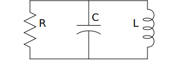

SVG Schematic
=============

:Author: Ken Kundert
:Version: 1.0.0
:Released: 2020-04-16

This package allows you to create simple SVG schematics and block diagrams 
without a mouse.  Instead, you build the schematic using Python to instantiate 
and place the symbols and wires.

Simple Example
--------------

Here is a simple example that demonstrates the package. It generates the 
schematic of a shunt RLC circuit:

.. code-block:: python

    from svg_schematic import Schematic, Resistor, Capacitor, Inductor, Wire
    from inform import Error, error, os_error

    try:
        with Schematic(filename='rlc.svg'):
            r = Resistor(name='R', orient='v')
            c = Capacitor(W=r.E, name='C', orient='v')
            l = Inductor(W=c.E, name='L', orient='v|')
            Wire([r.p, l.p])
            Wire([r.n, l.n])
    except Error as e:
        e.report()
    except OSError as e:
        error(os_error(e))

When run, it produces the following schematic:

Installation
------------

Requires Python3. Works best with Python3.6 or newer.

You can download and install the latest
stable version of the code from `PyPI <https://pypi.python.org>`_ using::

    pip3 install --user svg_schematic

You can find the latest development version of the source code on
`Github <https://github.com/KenKundert/svg_schematic>`_.

Documentation
-------------

You can find documentation at `ReadTheDocs 
<https://svg_schematic.readthedocs.io>`_.

Issues
------

Please ask questions or report problems on
`Github Issues <https://github.com/KenKundert/svg_schematic/issues>`_.

Contributions
-------------

Contributions in the form of pull requests are welcome.

I tend to create symbols as I need them.  If you create missing symbols, please
consider contributing them back to the project.
