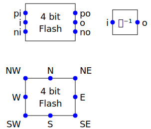
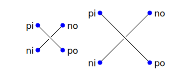

Classes and Functions
=====================

Schematic
---------

When creating a schematic you may specify the following arguments: ``filename``, 
``font_size``, ``font_family`` (ex. 'serif' or 'sans-serif'), ``line_width``, 
and ``dot_radius``.  The dot radius is the radius of solder-dots and pins.

You can also specify ``background`` and ``outline``, both of which are colors.  
The default background is 'white' and the default outline is 'none'. If you set 
background to 'none' be aware that this makes the concealers transparent, 
meaning that you cannot wire under components, instead you must wire to the 
pins.  It is common to start by setting outline to allow you to see the SVG 
drawing area, and then later remove it when your schematic is complete.
Pad arguments are used to adjust the size of the SVG 

The size of the SVG canvas is automatically sized to fit tightly around the 
specified schematic objects. You might find that the text associated with input 
and output pins has a tendency to extend beyond the canvas. This is because no 
attempt is made to estimate the width of text. Instead, you can increase the 
width of the pin's tile using its ``w`` parameter. In addition, you can also add 
padding when creating the schematic. There are five padding arguments. The most 
commonly used is ``pad``, which simply adds the same padding to all four edges.  
In addition, you can control the individual edges using ``left_pad``, 
``right_pad``, ``top_pad``, and ``bottom_pad``. These simply add to ``pad`` to 
create the final padding for each edge.

Wire
----

Draws a wire between two or more points given in sequence. Each point should be 
specified as a XY pair.  Example:

.. code-block:: python

    Wire([(x0,y0), (x1,y1), (x2,y2), (x3,y3)])

Specifying wires before the components places them on a lower level, allowing 
the component to obscure the wires when needed.

*Wire* supports the *kind* argument, which may be either ``plain``, ``|-``, 
``-|``, ``|-|``, or ``-|-``.  With plain, any-angle line segments are added 
between each of the points.  With ``|-``, ``-|``, ``|-|``, and ``-|-`` the wires 
are constrained to follow a Manhattan geometry (between each point there may be 
one, two, or three line segments that are constrained to be either purely 
vertical or purely horizontal.  With ``|-`` there are two segments, with the 
first being vertical.  With ``-|``, there are also two segments, but the first 
is horizontal.  With ``|-|``, and ``-|-`` there there are three segments with 
the middle segment being half way between the two points. With ``|-|``, the 
segments are vertical, horizontal, and vertical.  With ``-|-``, the segments are 
horizontal, vertical, and horizontal.

For example, if two resistors that are offset both horizontally and vertically 
are connected by a wire, the results depend on ``kind`` as follows:

.. image :: images/Golden/wires.svg
    :width: 40 %
    :align: center

*Wire* supports the ``line_width``  and ``color`` arguments.

*Wire* also supports arbitrary *svgwrite* drawing parameters. This can be useful 
to draw the wire with dashed lines:

.. code-block:: python

    Wire([(x0,y0), (x1,y1)], stroke_dasharray="4 2")

*Wire* provides the ``b``, ``m``,  and ``e`` attributes that contain the 
coordinates of the beginning, the midpoint and the ending of the wire.

Label
~~~~~

Place a label.  Five kinds of label are available, ``plain``, ``arrow``, 
``arrow|``, ``slash``, and ``dot``.

.. code-block:: python

    Label(kind='plain', name='plain', loc='se')
    Label(kind='arrow', name='arrow', loc='se')
    Label(kind='arrow|', name='arrow|', loc='se')
    Label(kind='slash', name='slash', loc='se')
    Label(kind='dot', name='dot', loc='se')

.. image:: images/Golden/label.svg
    :width: 15 %
    :align: center

Here the labels are drawn with wires to give better context.  The horizontal 
location of the labels is indicated with the vertical blue line.

Labels take the following arguments: ``kind``, ``orient``, ``name``, ``value``, 
``loc``, ``w``, ``h``, ``color``, ``nudge``, ``C``, ``N``, ``NE``, ``E``, 
``SE``, ``S``, ``SW``, ``W``, ``NW``, ``off``, ``xoff`` and ``yoff``.  Currently 
``value`` is ignored.

The ``C``, ``N``, ``NE``, ``E``, ``SE``, ``S``, ``SW``, ``W``, ``NW`` attributes 
contain the locations of the principle coordinates.
The ``t`` attribute contains the coordinates of the label.

The kind may be 'plain', 'arrow', 'arrow|', 'slash' or 'dot'.  If 'plain' is 
specified, no symbol is added, only the name is displayed.  If 'arrow' is 
specified, an arrow is added and the centered on the specified location. If 
'arrow|' is specified, the arrow terminates on the specified location.  If 
'slash' is specified, a small slash is added through the center.  It is 
generally used with buses to indicate the bus width.  Finally, 'dot' adds 
a solder dot.

By default the width and height of the label are 1, meaning that a unit sized 
tile (50×50) is used.  This is significant if the label is at the edge of the 
schematic.  If the labels extend beyond the tile, they may extend beyond the 
computed viewbox for the schematic.  You can fix this by specifying a larger 
width.

It is important to remember that C represents the center of the tile used by the 
label. Since the label will be on one side, C will not coincide with the 
apparent visual center of the label.

Components
----------

This section documents the available components. Components include an invisible 
tile in which the component should fit. The tile extent is used when determining 
the size of the overall schematic.  Each component requires that you specify 
location by giving the location of its principle coordinates or a pin. You can 
specify an placement offset using ``xoff``, ``yoff``, or ``off``. You can also 
generally specify the orientation, the name, the value, and a text offset using 
``orient``, ``name``, ``value``, and ``nudge``.

The ``orient`` is specified as a string that generally consists of either 'v' or 
'h', indicating that a vertical or horizontal orientation is desired, but may 
include '|' and '-', indicating that the component should be flipped about 
either the vertical or horizontal axis.

The *name* and *value* are strings that are added to the component as labels, 
though not all components display the *value*.  The *nudge* is a number that 
adjusts the placement of labels to avoid wires.

In addition, some components support other arguments, such as ``kind`` or 
``loc``.

You may pass wires directly under most components.  The component will conceal 
the wire in those places where it should not be shown. This makes it simpler to 
wire up a schematic as you don't need separate wires between a string of 
components that all fall in a line. Rather, you would just specify the wire 
first, and then it will run underneath the components.  This trick works as long 
as you do not specify the schematic background as 'none'.

Components generally place the location of their principle coordinates and the 
location of all their pins into named attributes.

Resistor
~~~~~~~~

Draw a resistor.

.. code-block:: python

    Resistor(name='Rs', value='50Ω')

.. image:: images/Golden/resistor.svg
    :width: 25 %
    :align: center

Resistors take the following arguments: ``orient``, ``name``, ``value``, 
``nudge``, ``C``, ``N``, ``NE``, ``E``, ``SE``, ``S``, ``SW``, ``W``, ``NW``, 
``p``, ``n``, ``off``, ``xoff`` and ``yoff``.

The ``C``, ``N``, ``NE``, ``E``, ``SE``, ``S``, ``SW``, ``W``, ``NW`` attributes 
contain the locations of the principle coordinates. The ``p`` and ``n`` 
attributes contain the locations of the positive and negative terminals.

You may pass a wire directly under the resistor and the wire will be concealed 
by the resistor.

Capacitor
~~~~~~~~~

Draws a capacitor.

.. code-block:: python

    Capacitor(name='C1', value='1.2pF')

.. image:: images/Golden/capacitor.svg
    :width: 15 %
    :align: center

Capacitors take the following arguments: ``orient``, ``name``, ``value``, 
``nudge``, ``C``, ``N``, ``NE``, ``E``, ``SE``, ``S``, ``SW``, ``W``, ``NW``, 
``p``, ``n``, ``off``, ``xoff`` and ``yoff``.

The ``C``, ``N``, ``NE``, ``E``, ``SE``, ``S``, ``SW``, ``W``, ``NW`` attributes 
contain the locations of the principle coordinates. The ``p`` and ``n`` 
attributes contain the locations of the positive and negative terminals.

You may pass a wire directly under the capacitor and the wire will be concealed 
by the capacitor.  The capacitor is polarized with reference end being terminal 
``n``.

Inductor
~~~~~~~~

Draws an inductor.

.. code-block:: python

    Inductor(name='L1', value='1μH')

.. image:: images/Golden/inductor.svg
    :width: 25 %
    :align: center

Inductors take the following arguments: ``orient``, ``name``, ``value``, 
``nudge``, ``C``, ``N``, ``NE``, ``E``, ``SE``, ``S``, ``SW``, ``W``, ``NW``, 
``p``, ``n``, ``off``, ``xoff`` and ``yoff``.

The ``C``, ``N``, ``NE``, ``E``, ``SE``, ``S``, ``SW``, ``W``, ``NW`` attributes 
contain the locations of the principle coordinates. The ``p`` and ``n`` 
attributes contain the locations of the positive and negative terminals.

You may pass a wire directly under the inductor and the wire will be concealed 
by the inductor.

Diode
~~~~~

Draws a diode.

.. code-block:: python

    Diode(name='D1')

.. image:: images/Golden/diode.svg
    :width: 25 %
    :align: center

Diodes take the following arguments: ``orient``, ``name``, ``value``, ``nudge``, 
``C``, ``N``, ``NE``, ``E``, ``SE``, ``S``, ``SW``, ``W``, ``NW``, ``p``, ``n``, 
``off``, ``xoff`` and ``yoff``.

The ``C``, ``N``, ``NE``, ``E``, ``SE``, ``S``, ``SW``, ``W``, ``NW`` attributes 
contain the locations of the principle coordinates.  The ``a`` and ``c`` 
attributes contain the coordinates of the anode and cathode terminals.

You may pass a wire directly under the diode and the wire will be concealed by 
the diode.

BJT
~~~

Draws a bipolar transistor. Two kinds of BJT are available, *npn* and *pnp*.

.. code-block:: python

    MOS(kind='n', name='Qn')
    MOS(kind='p', name='Qp')

.. image:: images/Golden/bjt.svg
    :width: 40 %
    :align: center

BJTs take the following arguments: ``kind``, ``orient``, ``name``, ``value``, 
``nudge``, ``C``, ``N``, ``NE``, ``E``, ``SE``, ``S``, ``SW``, ``W``, ``NW``, 
``p``, ``n``, ``off``, ``xoff`` and ``yoff``.  ``kind`` may be ``npn`` or 
``pnp``, or simply ``n`` or ``p``.

The ``C``, ``N``, ``NE``, ``E``, ``SE``, ``S``, ``SW``, ``W``, ``NW`` attributes 
contain the locations of the principle coordinates.
The ``c``, ``b`` and ``e`` attributes contain the coordinates of the collector, 
base and emitter terminals.

If ``kind`` is 'p' or 'pnp' a PNP symbol is drawn, otherwise an NPN symbol is 
drawn.

You may pass a wire directly under the transistor and the wire will be concealed 
by the transistor.

MOS
~~~

Draws a MOSFET.  Three kinds of FET are available, *nmos*, *pmos*, and 
non-polarized.

.. code-block:: python

    MOS(kind='n', name='Mn')
    MOS(kind='p', name='Mp')
    MOS(kind='', name='M')

.. image:: images/Golden/mos.svg
    :width: 60 %
    :align: center

MOSFETs take the following arguments: ``kind``, ``orient``, ``name``, ``value``, 
``nudge``, ``C``, ``N``, ``NE``, ``E``, ``SE``, ``S``, ``SW``, ``W``, ``NW``, 
``p``, ``n``, ``off``, ``xoff`` and ``yoff``.
``kind`` may be ``nmos`` or ``pmos``, or simply ``n`` or ``p``.  If an empty 
string is specified, the terminal locations are those of an *nmos*, but the 
arrow is not drawn.

The ``C``, ``N``, ``NE``, ``E``, ``SE``, ``S``, ``SW``, ``W``, ``NW`` attributes 
contain the locations of the principle coordinates.
The ``d``, ``g`` and ``s`` attributes contain the coordinates of the drain, gate 
and source terminals.

If ``kind`` is 'n' or 'nmos' an NMOS symbol is drawn; if ``kind`` is 'p' or 
'pmos' a PMOS symbol is drawn; otherwise an unpolarized symbol is drawn.

You may pass a wire directly under the transistor and the wire will be concealed 
by the transistor.

Amplifiers and Converters
~~~~~~~~~~~~~~~~~~~~~~~~~

Draws an amplifier or a converter.
Four kinds are available, single-ended (``se``), opamp (``oa``), differential 
amplifier (``da``) and comparator (``comp``).

.. code-block:: python

    Amp(kind='se', name='As')
    Amp(kind='oa', name='Ao')
    Amp(kind='da', name='Ad')
    Amp(kind='comp', name='Ac')
    Converter(kind='se', name='Cs')
    Converter(kind='oa', name='Co')
    Converter(kind='da', name='Cd')
    Converter(kind='comp', name='Cc')

.. image:: images/Golden/amp.svg
    :width: 100 %
    :align: center

Amplifiers and Converters take the following arguments: ``kind``, ``orient``, 
``name``, ``value``, ``C``, ``N``, ``NE``, ``E``, ``SE``, ``S``, ``SW``, ``W``, 
``NW``, ``p``, ``n``, ``off``, ``xoff`` and ``yoff``.
``kind`` may be ``se``, ``oa``, ``da`` or ``comp``.

The ``C``, ``N``, ``NE``, ``E``, ``SE``, ``S``, ``SW``, ``W``, ``NW`` attributes 
contain the locations of the principle coordinates.
The ``pi``, ``i``, ``ni``
``po``, ``o``, and ``no`` attributes contain the coordinates of the positive 
input, the input, the negative input, the positive output, the output, and the 
negative output terminals.  All 6 pin attributes are always available, even if 
they do not seem appropriate for the kind of amplifier drawn.

You can reshape the amplifier or converter using ``w`` and ``h`` to specify the 
width and height.  The default values for each are 2, and you should not deviate 
too far from 2 or you will end up with an ugly symbol.

You may pass a wire or wires directly under the amplifier or converter and the 
wire will be concealed.

Gate
~~~~

Draws a gate.  Currently the only supported kind of gate is ``inv``, an 
inverter.

.. code-block:: python

    Gate(kind='inv', name='U')

.. image:: images/Golden/gate.svg
    :width: 25 %
    :align: center

Gates take the following arguments: ``kind``, ``orient``, ``name``, ``value``, 
``nudge``, ``C``, ``N``, ``NE``, ``E``, ``SE``, ``S``, ``SW``, ``W``, ``NW``, 
``p``, ``n``, ``off``, ``xoff`` and ``yoff``.
``kind`` may be ``inv``.

The ``C``, ``N``, ``NE``, ``E``, ``SE``, ``S``, ``SW``, ``W``, ``NW`` attributes 
contain the locations of the principle coordinates.
The ``i`` and ``o`` attributes contain the coordinates of the input and the 
output.

You may pass a wire or wires directly under the gate and the wire will be 
concealed by the gate.

Source
~~~~~~

Draws a source.
Eight kinds of source are available, ``empty``, ``vdc``, ``idc``, ``sine``, 
``sum`` (summer), ``mult`` (multiplier), ``cv`` (controlled voltage) and ``ci`` 
(controlled current).

.. code-block:: python

    Source(kind='empty', name='Ve')
    Source(kind='vdc', name='Vd')
    Source(kind='idc', name='Id')
    Source(kind='sine', name='Vs')
    Source(kind='sum', name='S')
    Source(kind='mult', name='M')
    Source(kind='cv', name='Vc')
    Source(kind='ci', name='Ic')

.. image:: images/Golden/source.svg
    :width: 75 %
    :align: center

Sources take the following arguments: ``kind``, ``orient``, ``name``, ``value``, 
``nudge``, ``C``, ``N``, ``NE``, ``E``, ``SE``, ``S``, ``SW``, ``W``, ``NW``, 
``p``, ``n``, ``off``, ``xoff`` and ``yoff``.
``kind`` may be ``empty``, ``vdc``, ``idc``, ``sine``, ``sum``, ``mult``, ``cv`` 
or ``ci``.

The ``C``, ``N``, ``NE``, ``E``, ``SE``, ``S``, ``SW``, ``W``, ``NW`` attributes 
contain the locations of the principle coordinates, but unlike all other 
components, these are evenly distributed about the circle that envelopes the 
source.
The ``p`` and ``n`` attributes contain the coordinates of the positive and
negative pins.
The pin attributes are always available, even if they do not seem appropriate 
for the kind of source drawn.

You may pass a wire or wires directly under the source and the wire will be 
concealed by the source.

Switch
~~~~~~

Draws a switch.
Two kinds of switch are available, ``spst`` (single-pole, single-throw) and 
``spdt`` (single-pole, double-throw).

.. code-block:: python

    Switch(kind='spst', name='φ₁')
    Switch(kind='spdt', name='φ₂')

.. image:: images/Golden/switch.svg
    :width: 40 %
    :align: center

Switches take the following arguments: ``kind``, ``orient``, ``name``, 
``value``, ``dots``, ``nudge``, ``C``, ``N``, ``NE``, ``E``, ``SE``, ``S``, 
``SW``, ``W``, ``NW``, ``i``, ``o``, ``ot``, ``ob``, ``off``, ``xoff`` and 
``yoff``.  ``kind`` may be ``spst`` or ``spdt``.  The *dots* argument determines 
whether the poles of the switch should be denoted with large dots.

The ``C``, ``N``, ``NE``, ``E``, ``SE``, ``S``, ``SW``, ``W``, ``NW`` attributes 
contain the locations of the principle coordinates.  The ``i`` ``ot``, ``o`` and 
``ob`` attributes contain the coordinates of the input, the top output, the 
output, and the bottom output pins.  The pin attributes are always available, 
even if they do not seem appropriate for the kind of switch drawn.

You may pass a wire or wires directly under the switch and the wire will be 
concealed by the switch.

Box
~~~

Draws a box.

.. code-block:: python

    Box(name='4 bit', value='Flash')
    Box(name='𝘻⁻¹', w=1, h=1)

Boxes take the following arguments: ``orient``, ``name``, ``value``, ``nudge``, 
``line_width``, ``background``, ``w``, ``h``, ``C``, ``N``, ``NE``, ``E``, 
``SE``, ``S``, ``SW``, ``W``, ``NW``, ``i``, ``pi``, ``ni``, ``o``, ``po``, 
``no``, ``off``, ``xoff`` and ``yoff``.  In addition, you may specify *SVGwrite* 
arguments, as shown in the example below.

The ``C``, ``N``, ``NE``, ``E``, ``SE``, ``S``, ``SW``, ``W``, ``NW`` attributes 
contain the locations of the principle coordinates.  They are arranged along the 
surface of the box.

The ``i`` ``pi``, ``ni`` and ``o``, ``po``, ``no`` attributes contain the 
coordinates of the input and output pins.

Boxes also support arbitrary *svgwrite* drawing parameters. This can be useful 
to draw the box with dashed lines:

.. code-block:: python

    Box(w=1, h=1, stroke_dasharray="4 2")

Crossing
~~~~~~~~

Draws a wire crossing in such a was as to maintain symmetry in schematics.

.. code-block:: python

    Crossing()
    Crossing(w=2, h=2)

Crossings take the following arguments: , ``pass_under``, ``w``, ``h``, ``C``, 
``N``, ``NE``, ``E``, ``SE``, ``S``, ``SW``, ``W``, ``NW``, ``pi``, ``ni``, 
``po``, ``no``, ``off``, ``xoff`` and ``yoff``.

The ``C``, ``N``, ``NE``, ``E``, ``SE``, ``S``, ``SW``, ``W``, ``NW`` attributes 
contain the locations of the principle coordinates.
The ``pi`` and ``pi`` attributes contain the coordinates of the input and output 
pins.

Ground
~~~~~~

Draws a ground.

.. code-block:: python

    Ground()

.. image:: images/Golden/ground.svg
    :width: 7 %
    :align: center

Grounds take the following arguments: ``orient``, ``name``, ``value``,
``nudge``, ``C``, ``N``, ``NE``, ``E``, ``SE``, ``S``, ``SW``, ``W``, ``NW``, 
``t``, ``off``, ``xoff`` and ``yoff``.  Currently ``value`` is ignored.

The ``C``, ``N``, ``NE``, ``E``, ``SE``, ``S``, ``SW``, ``W``, ``NW`` attributes 
contain the locations of the principle coordinates.
The ``t`` attribute contains the coordinates of the ground's terminal.

Pin
~~~

Draws a pin.  Four kinds of pin are available, ``none``, ``dot``, ``in``, and 
``out``.

.. code-block:: python

    Pin(kind='none', name='none', value='none value')
    Pin(kind='dot', name='dot', value='dot value')
    Pin(kind='in', name='in')
    Pin(kind='out', name='out')

.. image:: images/Golden/pin.svg
    :width: 30 %
    :align: center

Here the pins are drawn with wires to give better context.  The horizontal 
location of the pins is indicated with the vertical blue line.

Pins take the following arguments: ``kind``, ``orient``, ``name``, ``value``, 
``nudge``, ``w``, ``h``, ``color``, ``C``, ``N``, ``NE``, ``E``, ``SE``, ``S``, 
``SW``, ``W``, ``NW``, ``t``, ``off``, ``xoff`` and ``yoff``.  Currently 
``value`` is ignored for ``in`` and ``out`` pins.

The ``C``, ``N``, ``NE``, ``E``, ``SE``, ``S``, ``SW``, ``W``, ``NW`` attributes 
contain the locations of the principle coordinates.
The ``t`` attribute contains the coordinates of the pin.

It is important to remember that C represents the center of the tile used by the 
pin. Since the pin label will be on one side, C will not coincide with the 
apparent visual center of the pin and its label.

Pins of kind ``none`` do not draw a symbol. Rather they are used to place labels 
at a particular point. ``dot`` pins place a small filled circle that is usually 
used to represent a solder dot (though you can change the color to the 
background color, generally 'white', and place it between two crossing wires to 
create a visual gap in the lower wire).  Pins of type ``in`` and ``out`` render 
with a hollow circle that is offset slightly a wire terminates on one side. 
These two pin types ignore the ``value`` argument.

By default the width and height of the pin are 1, meaning that a unit sized tile 
(50×50) is used.  This is significant if the pin is at the edge of the 
schematic.  If the labels extend beyond the tile, they may extend beyond the 
computed viewbox for the schematic.  You can fix this by specifying a larger 
width.

Dot
~~~

Draw a solder dot (a small filled circle) or a wire gap (a small filled circle 
with the color of the background that is placed between two crossing wires).  
Dot is just an alias for Pin, except that the default kind is 'dot'.

It is common to place a dot at a level between two crossing wires and specify 
a color of white to create a pass-under.

.. code-block:: python

    Dot()

Label
~~~~~

Place a label.  Five kinds of label are available, ``plain``, ``arrow``, 
``arrow|``, ``slash``, and ``dot``.

.. code-block:: python

    Label(kind='plain', name='plain', loc='se')
    Label(kind='arrow', name='arrow', loc='se')
    Label(kind='arrow|', name='arrow|', loc='se')
    Label(kind='slash', name='slash', loc='se')
    Label(kind='dot', name='dot', loc='se')

.. image:: images/Golden/label.svg
    :width: 15 %
    :align: center

Here the labels are drawn with wires to give better context.  The horizontal 
location of the labels is indicated with the vertical blue line.

Labels take the following arguments: ``kind``, ``orient``, ``name``, ``value``, 
``loc``, ``w``, ``h``, ``color``, ``nudge``, ``C``, ``N``, ``NE``, ``E``, 
``SE``, ``S``, ``SW``, ``W``, ``NW``, ``off``, ``xoff`` and ``yoff``.  Currently 
``value`` is ignored.

The ``C``, ``N``, ``NE``, ``E``, ``SE``, ``S``, ``SW``, ``W``, ``NW`` attributes 
contain the locations of the principle coordinates.
The ``t`` attribute contains the coordinates of the label.

The kind may be 'plain', 'arrow', 'arrow|', 'slash' or 'dot'.  If 'plain' is 
specified, no symbol is added, only the name is displayed.  If 'arrow' is 
specified, an arrow is added and the centered on the specified location. If 
'arrow|' is specified, the arrow terminates on the specified location.  If 
'slash' is specified, a small slash is added through the center.  It is 
generally used with buses to indicate the bus width.  Finally, 'dot' adds 
a solder dot.

By default the width and height of the label are 1, meaning that a unit sized 
tile (50×50) is used.  This is significant if the label is at the edge of the 
schematic.  If the labels extend beyond the tile, they may extend beyond the 
computed viewbox for the schematic.  You can fix this by specifying a larger 
width.

It is important to remember that C represents the center of the tile used by the 
label. Since the label will be on one side, C will not coincide with the 
apparent visual center of the label.

Location Functions
------------------

shift
~~~~~

Shifts a point by specified amounts in both the *x* and *y* directions.

.. py:function:: shift(point, dx, dy)

*point* is an (*x*, *y*) coordinate and *dx* and *dy* are numbers.  The return 
value is (*x* + *dx*, *y* + *dy*).

shift_x
~~~~~~~

Shifts a point by specified amount in the *x* direction.

.. py:function:: shift_x(point, dx)

*point* is an (*x*, *y*) coordinate and *dx* is a number.  The return value is 
(*x* + *dx*, *y*).

shift_y
~~~~~~~

Shifts a point by specified amount in the *y* direction.

.. py:function:: shift_y(point, dy)

*point* is an (*x*, *y*) coordinate and *dy* is a number.  The return value is 
(*x*, *y* + *dy*).

with_x
~~~~~~

Returns the first argument (a coordinate pair) with the *x* value replaced with
the second argument.  The second argument may either be a number or a coordinate 
pair.

.. py:function:: with_x(point, x)

with_y
~~~~~~

Returns the first argument (a coordinate pair) with the *y* value replaced with
the second argument.  The second argument may either be a number or a coordinate 
pair.

.. py:function:: with_y(point, y)

with_min_x
~~~~~~~~~~

Returns the first argument (a coordinate pair) with the *x* value replaced with
the smallest of the remaining arguments.  The remaining arguments may either be 
numbers or a coordinate pairs.

.. py:function:: with_min_x(point, ...)

with_max_x
~~~~~~~~~~

Returns the first argument (a coordinate pair) with the *x* value replaced with
the largest of the remaining arguments.  The remaining arguments may either be 
numbers or a coordinate pairs.

.. py:function:: with_max_x(point, ...)

with_min_y
~~~~~~~~~~

Returns the first argument (a coordinate pair) with the *y* value replaced with
the smallest of the remaining arguments.  The remaining arguments may either be 
numbers or a coordinate pairs.

.. py:function:: with_min_y(point, ...)

with_max_y
~~~~~~~~~~

Returns the first argument (a coordinate pair) with the *y* value replaced with
the largest of the remaining arguments.  The remaining arguments may either be 
numbers or a coordinate pairs.

.. py:function:: with_max_y(point, ...)

midpoint
~~~~~~~~

Returns the point midway between two points.

.. py:function:: midpoint(point1, point2)

midpoint_x
~~~~~~~~~~

Returns the point with *x* value midway between two points and the *y* value of 
the first point.

.. py:function:: midpoint_x(point1, point2)

midpoint_y
~~~~~~~~~~

Returns the point with *y* value midway between two points and the *x* value of 
the first point.

.. py:function:: midpoint_y(point1, point2)

Exceptions
----------

In the rare cases where *SVG_Schematic* it raises an error, it uses `Inform 
Error <https://inform.readthedocs.io/en/latest/user.html#exceptions>`_.  
*SVG_Schematic* is a wrapper around `svgwrite 
<https://svgwrite.readthedocs.io/en/stable/index.html>`_.  It is not clear what 
exceptions it will raise, but at a minimum it would raise *OSError* if it is 
unable to open or close the SVG file.  Thus you should catch these two 
exceptions. See :ref:`noninverting amplifier` to see how this is done.
