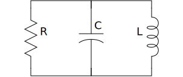

Concepts
========

With *svg_schematic* you simply pick one symbol and place it at the origin and 
then place the other symbols relative to the ones previously placed.  For 
example:

.. code-block:: python

    from svg_schematic import Schematic, Resistor, Capacitor, Inductor, Wire
    from inform import Error, error, os_error

    try:
        with Schematic(filename='rlc.svg'):
            r = Resistor(name='R', orient='v')
            c = Capacitor(C=r.C, xoff=100, name='C', orient='v')
            l = Inductor(C=c.C, xoff=100, name='L', orient='v')
            Wire([r.p, l.p])
            Wire([r.n, l.n])
    except Error as e:
        e.report()
    except OSError as e:
        error(os_error(e))

When run, it produces the following schematic:

.. image:: images/Golden/rlc.svg
    :width: 35 %
    :align: center

Component Placement
-------------------

In this example the resistor is placed without a location, and so its center is 
placed at the origin, (0, 0).  You can then access the location of the center of 
the resistor using ``r.C``, which is a XY-pair. That is passed to the capacitor 
using `C=r.C` with an extra parameter of ``xoff=100``, meaning the center of the 
capacitor is horizontally offset by 100 units from center of the resistor.  To 
give you a sense of how far 100 units is, the length of the resistor is 100 
units.  Positive horizontal offsets shift the location to the right, positive 
vertical offsets shift the location down.  Finally, the inductor is placed 100 
units to the right of the capacitor.

When specifying offsets, you can specify the x-offset using ``xoff``, the 
y-offset using ``yoff``, and you can specify both with ``off`` as a tuple. For 
example, ``off=(50,25)`` is equivalent to ``xoff=50, yoff=25``.

Wires are added using an list of points, where each point is an XY-pair. In the 
simplest case, a line is run between each of the points specified.  Thus, the 
first wire runs from ``r.p`` to ``l.p``, where ``r`` is the resistor and ``r.p`` 
is the location of the ``p`` terminal of the resistor.  ``l.p`` is the location 
of the positive terminal of the inductor.  The second wire connects the negative 
pins.

Principle Coordinates
---------------------

Each component is embedded in a tile, and each tile has 9 principle coordinate 
named C, N, NE, E, SE, S, SW, W, and NW which are short for center, north, 
northeast, east, southeast, south, southwest, west and northwest.

.. image:: images/Golden/tile1.svg
    :width: 50 %
    :align: center

When placing a component, you can give the location of any of the principle 
coordinates. And once placed, you can access the location of any of the 
principle coordinates. Thus, the location of the components in the example could 
be specified simply by placing the tiles side-by-side:

.. code-block:: python

    with Schematic(filename = "rlc.svg"):
        r = Resistor(name='R', orient='v')
        c = Capacitor(W=r.E, name='C', orient='v')
        l = Inductor(W=c.E, name='L', orient='v|')
        Wire([r.p, c.p, l.p])
        Wire([r.n, c.n, l.n])

This places the west principle coordinate of ``c`` on the east principle 
coordinate of ``r`` and then the west principle coordinate of ``l`` on the east 
principle coordinate of ``c``.

Pins as Coordinates
-------------------

You can also specify and access the component pin locations. For example, with 
the resistor there are two terminals ``p`` and ``n``.

.. image:: images/Golden/tile2.svg
    :width: 50 %
    :align: center

Using this approach you can draw a series RLC using:

.. code-block:: python

    with Schematic(filename = "rlc.svg"):
        r = Resistor(name='R', orient='h')
        c = Capacitor(n=r.p, name='C', orient='h|')
        l = Inductor(n=c.p, name='L', orient='h')

When run, it produces the following schematic:

.. image:: images/Golden/rlc1b.svg
    :width: 40 %
    :align: center

Orientation
-----------

You can flip and rotate the components using the ``orient`` argument.
Specifying ``v`` implies a vertical orientation, and ``h`` a horizontal 
orientation (a component is converted from vertical to horizontal with a -90 
degree rotation.  Adding ``|`` implies the component should be flipped along 
a vertical axis (left to right) and adding ``-`` implies the component should be 
flipped along a horizontal axis (up to down).

.. image:: images/Golden/orient.svg
    :width: 60 %
    :align: center

Name and Value
--------------

With most components you can specify a name, and with many components you can 
also specify a value.  The text orientation will always be horizontal regardless 
of the component orientation.  You can also specify ``nudge`` as a small number 
to adjust the location of the resulting text.  For example:

.. code-block:: python

    from svg_schematic import (
        Schematic, Capacitor, Ground, Inductor, Resistor, Pin, Source, Wire
    )
    from inform import Error, error, os_error

    try:
        with Schematic(
            filename = 'mfed.svg',
            background = 'none',
        ):
            vin = Source(name='Vin', value='1 V', kind='sine')
            Ground(C=vin.n)
            rs = Resistor(name='Rs', value='50 Ω', n=vin.p, xoff=25)
            Wire([vin.p, rs.n])
            c1 = Capacitor(name='C1', value='864 pF', p=rs.p, xoff=25)
            Ground(C=c1.n)
            l2 = Inductor(name='L2', value='5.12 μH', n=c1.p, xoff=25)
            Wire([rs.p, l2.n])
            c3 = Capacitor(name='C3', value='2.83 nF', p=l2.p, xoff=25)
            Ground(C=c3.n)
            l4 = Inductor(name='L4', value='8.78 μH', n=c3.p, xoff=25)
            Wire([l2.p, l4.n])
            c5 = Capacitor(name='C5', value='7.28 nF', p=l4.p, xoff=25)
            Ground(C=c5.n)
            rl = Resistor(name='Rl', value='50 Ω', p=c5.p, xoff=100, orient='v')
            Ground(C=rl.n)
            out = Pin(name='out', C=rl.p, xoff=50, w=2)
            Wire([l4.p, out.t])
    except Error as e:
        e.report()
    except OSError as e:
        error(os_error(e))

Kind
----

Many components allow you to specify ``kind``, which allow you to choose 
a variant of the component symbol. They include

======  ========================================================
Symbol  Kinds
======  ========================================================
BJT     ``npn``, ``pnp`` (or ``n``, ``p``)
MOS     ``nmos``, ``pmos`` (or ``n``, ``p``)
Amp     ``se``, ``oa``, ``da``, ``comp``
Gate    ``inv``
Pin     ``dot``, ``in``, ``out``, ``none``
Label   ``plain``, ``arrow``, ``arrow|``, ``slash``, ``dot``
Source  ``empty``, ``vdc``, ``idc``, ``sine``, ``sum``, ``mult``
        ``cv``, ``ci``
Switch  ``spst``, ``spdt``
Wire    ``plain``, ``|-``, ``-|``, ``|-|``, ``-|-``
======  ========================================================

These are explained further later when the individual symbols are discussed.

Miscellany
----------

There are a few things to note.

#.  SVG coordinates are used, which inverts the y axis (more southern 
    coordinates are more positive than the more northern coordinates).
#.  Wires and components stack in layers, with the first that is placed going on 
    the lowest layer.  Most components contain concealers, which are small 
    rectangles that are designed to conceal any wires that run underneath the 
    components. This allows you to simply run a wire underneath the component 
    rather than explicitly wire to each terminal, which can simply the 
    description of the schematics. For this to work, the wire must be specified 
    before the component. Also, the color of the concealers matches that of the 
    background, so if you use no background, then you also lose the concealers.
#.  Components are placed in invisible tiles.  The unit size of a tile is 50.  
    You have limited ability to specify the width and height of some components, 
    and specifying the size as ``w=1, h=1`` implies the tile will be 50x50.  
    Most components have a size of 2×2 and so sit within a 100x100 tile.  You 
    need not specify the size as an integer.
#.  When the schematic is used with Latex, you can use Latex formatting in the 
    name and value. For example, you can specify: `name='$L_1$'`. You should use 
    raw strings if your string contains backslashes: `value=r'$10 \\mu H$'`.
#.  Components provide provide individual attributes for the location of each 
    terminal.  For example, the resistor, capacitor, and inductor components 
    provide the *p* and *n* terminal attributes. The MOS component provides the 
    *d*, *g*, and *s* terminal attributes. The diode component provides the *a* 
    and *c* terminal attributes.
#.  Components contain attributes for each of the 9 principal coordinates (C, N, 
    NE, E, SE, S, SW, W, NW).  For most components, these are the principal 
    coordinates for the component's tile. However, the source places its 
    principal coordinates on the circle used to depict the source.

Placement Strategies
--------------------

There are two basic approaches to placing components. First, you may specify the 
coordinate in absolute terms. For example:

.. code-block:: python

    with Schematic(filename = "rlc.svg"):
        Wire([(-75, -50), (75, -50), (75, 50), (-75, 50)])
        Wire([(0, -50), (0, 50)])
        Resistor(C=(-75, 0), name='R', orient='v')
        Capacitor(C=(0, 0), name='C', orient='v')
        Inductor((C=(75, 0), name='L', orient='v|')

Notice that a wire is specified as a list of points, where each point is a tuple 
that contains an XY pair.  The wire just connects the points with line segments.  
The location of the components is given by giving the location of a feature on 
the component. In this case it is the center (``C``) of the component that is 
specified. Again the location is an XY-pair.

This approach turns out to be rather cumbersome as it requires a lot of planning 
and is a lot of work if you need to move things around.  In that case you likely 
have to adjust a large number coordinates.  Since schematics of any complexity 
are often adjusted repeatedly before they are correct and aesthetically 
appealing, this approach can lead to a lot of tedious work.

The second basic approach to placing component is to place them relative to each 
other. This approach is the one that is always used in practice. To do so, you 
would generally take advantage of the fact that components have attributes that 
contains useful coordinate locations on the component. For example:

.. code-block:: python

    r = Resistor(C=(0, 0), name='R', orient='v')

Now, *r.C*, *r.N*, *r.NE*, *r.E*, *r.SE*, *r.S*, *r.SW*, *r.W*, and *r.NW* 
contain the coordinates of the center, north, northeast, east, southeast, south, 
southwest, west, and northwest corners.  In addition, *r.p* and *r.n* hold the 
coordinates of the positive and negative terminals.  Finally, wires provide the 
*b*, *m*, and *e* attributes, which contain the coordinates of their beginning, 
midpoint, and ending.

Once you place the first component, you then specify the location of the 
remaining components relative to one that has already been placed. To do so, you 
would give the location of one of the principle coordinates or the location of 
a terminal.  For example:

.. code-block:: python

    r = Resistor(C=(0, 0), name='R', orient='v')
    c = Capacitor(C=r.C, xoff=75, name='C', orient='v')
    l = Inductor((C=c.C, xoff=75, name='L', orient='v|')
    Wire([r.p, c.p, l.p], kind='-|-')
    Wire([r.n, c.n, l.n], kind='-|-')

.. image:: images/Golden/rlc.svg
    :width: 35 %
    :align: center

Notice that the center of ``r`` is placed at (0,0), then the center of ``c`` is 
place 75 units to the right of ``r``, then the center of ``l`` is placed 75 
units to the right of ``c``.  If ``c`` has to be moved for some reason then 
``l`` will move with it.  For example, only changing the line that instantiates 
the capacitor produces the following results:

.. code-block:: python

    c = Capacitor(C=r.C, off=(100, 25), name='C', orient='v')

.. image:: images/Golden/rlc2.svg
    :width: 35 %
    :align: center

The *shift*, *shift_x*, and *shift_y* utility functions are provided to shift 
the position of a coordinate pair.  Examples:

.. code-block:: python

    shift((x,y), dx, dy) --> (x+dx, y+dy)
    shift_x((x,y), dx) --> (x+dx, y)
    shift_y((x,y), dy) --> (x, y+dy)

To see how these might be useful, consider offsetting the wires so they sit 
a little further away from the components:

.. code-block:: python

    r = Resistor(C=(0, 0), name='R', orient='v')
    c = Capacitor(C=r.C, xoff=75, name='C', orient='v')
    l = Inductor((C=c.C, xoff=75, name='L', orient='v|')
    Wire([r.p, shift_y(r.p, -12.5), shift_y(c.p, -12.5), c.p])
    Wire([c.p, shift_y(c.p, -12.5), shift_y(l.p, -12.5), l.p])
    Wire([r.n, shift_y(r.n, 12.5), shift_y(c.n, 12.5), c.n])
    Wire([c.n, shift_y(c.n, 12.5), shift_y(l.n, 12.5), l.n])

You can also use *with_x* and *with_y* to replace the *x* or *y* portion of 
a coordinate pair. They take two arguments, the first is returned with the 
appropriate coordinate component replaced by the second. The second argument may 
be a simple number or it may be a coordinate pair, in which case the appropriate 
coordinate component is used to replace the corresponding component in the first 
argument:

.. code-block:: python

    with_x((x1,y1), x2) --> (x2, y1)
    with_y((x1,y1), y2) --> (x1, y2)
    with_x((x1,y1), (x2,y2)) --> (x2, y1)
    with_y((x1,y1), (x2,y2)) --> (x1, y2)

Finally, the *midpoint* functions return the point midway between two points:

.. code-block:: python

    midpoint((x1,y1), (x2,y2) --> ((x1+x2)/2, (y1+y2)/2)
    midpoint_x((x1,y1), (x2,y2) --> ((x1+x2)/2, y1)
    midpoint_y((x1,y1), (x2,y2) --> (x1, (y1+y2)/2)

Arbitrary Drawing Features using SVGwrite
-----------------------------------------

*SVG_Schematic* subclasses the Python `svgwrite package
<https://pythonhosted.org/svgwrite>`_  *Drawing* class. So you can call any 
*Drawing* method from a schematic. In this case you must keep the schematic 
instance to access the methods:

.. code-block:: python

    with Schematic(filename = "hello.svg") as schematic:
        schematic.circle(
            center=(0,0), r=100, fill='none', stroke_width=1, stroke='black'
        )
        schematic.text(
            'Hello', insert=(0,0), font_family='sans', font_size=16, fill='black'
        )

One thing to note is that *Schematic* normally keeps track of the location and 
extent of the schematic objects and sizes the drawing accordingly. It will be 
unaware of anything added directly to the drawing though the *svgwrite* methods.
As a result, these objects may fall partially or completely outside the bounds 
of the drawing. You can add padding when you first instantiate *Schematic* or 
you can use the *svgwrite* *viewbox* method to extend the bounds.

Latex
-----

To include these schematics into Latex documents, you need to run `Inkscape 
<https://inkscape.org>`_  with the --export-latex command line option to 
generate the files that you can include in Latex. Here is a Makefile that you 
can use to keep all these files up to date::

    DRAWINGS = \
        flash-adc \
        pipeline-adc \
        delta-sigma-adc

    SVG_FILES=$(DRAWINGS:=.svg)
    PDF_FILES=$(DRAWINGS:=.pdf)
    PDFTEX_FILES=$(DRAWINGS:=.pdf_tex)

    .PHONY: clean
    .PRECIOUS: %.svg

    %.svg: %.py
            python3 $<

    %.pdf: %.svg
            inkscape -z -D --file=$< --export-pdf=$@ --export-latex

    clean:
            rm -rf $(PDF_FILES) $(PDFTEX_FILES) __pycache__

To include the files into your Latex document, use::

    \def\svgwidth{0.5\columnwidth}
    \input{delta-sigma.pdf_tex}

Finally, to convert your Latex file to PDF, use::

    pdflatex --shell-escape converters.tex

Other Image Formats
-------------------

You can use Image Magick package to convert SVG files to other image formats.  
For example::

    convert receiver.svg receiver.png
