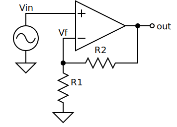

Examples
========

.. _noninverting amplifier:

Non Inverting Amplifier
-----------------------

Here is an example of a typical schematic with exception handling.

.. include:: ../examples/noninverting.py
    :literal:

Inverting Amplifier
-------------------

This schematic uses ``line_width = 1`` give the schematic a lighter look.
It uses a 16 point serif font.

.. include:: ../examples/inverting.py
    :literal:

.. image::  ../examples/Golden/inverting.svg
    :width: 50%
    :align: center

Charge Pump
-----------

This example has a transparent background and so all wires terminate at 
terminals rather than passing underneath components. The labels are intended to 
be rendered by Latex.
It sets ``line_width`` to 2 give the schematic a heavier look.

.. include:: ../examples/charge-pump.py
    :literal:

.. image:: ../examples/Golden/charge-pump.svg
    :width: 80%
    :align: center

Inverter
--------

This example has a transparent background and so all wires terminate at 
terminals rather than passing underneath components. The labels are intended to 
be rendered by Latex.
It sets ``line_width`` to 2 give the schematic a heavier look.

.. include:: ../examples/inverter.py
    :literal:

.. image::  ../examples/Golden/inverter.svg
    :width: 30%
    :align: center

Oscillator
----------

This example has a transparent background and so all wires terminate at 
terminals rather than passing underneath components. The labels are intended to 
be rendered by Latex.
This schematic uses ``line_width = 2`` give the schematic a heavier look.

.. include:: ../examples/oscillator.py
    :literal:

.. image::  ../examples/Golden/oscillator.svg
    :width: 40%
    :align: center

Passive Low Pass Filter
-----------------------

This example uses `QuantiPhy 
<https://quantiphy.readthedocs.io/en/latest/index.html>`_ to compute the values 
for the components in a low pass filter and then constructs the schematic using 
those values.  It sets ``line_width`` to 2 and employs dots at wire junctions to 
give the schematic a heavier look.

.. include:: ../examples/mfed.py
    :literal:

Pipelined ADC
-------------

This block diagram has a white background and so could route wires under 
components rather than wiring to terminals, but it largely does not.
It uses ``line_width = 2`` give the diagram a heavier look.

.. include:: ../examples/pipeline-adc.py
    :literal:

.. image::  ../examples/Golden/pipeline-adc.svg
    :width: 100%
    :align: center

Receiver
--------

This block diagram has a white background and so could route the wires 
underneath the components, but does not.
It uses ``line_width = 2`` give the diagram a heavier look.
It looks small because it is quite wide, and it is scaled to fit the page.

.. include:: ../examples/receiver.py
    :literal:

.. image::  ../examples/Golden/receiver.svg
    :width: 100%
    :align: center

Network Map
-----------

This is another block diagram.

.. include:: ../examples/network-map.py
    :literal:

.. image::  ../examples/Golden/network-map.svg
    :width: 75%
    :align: center
