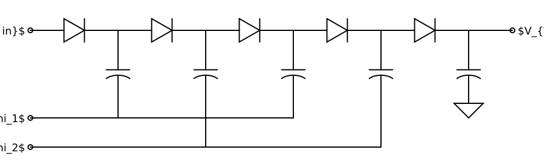
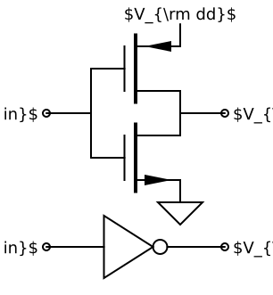
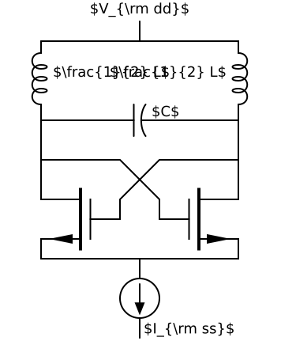
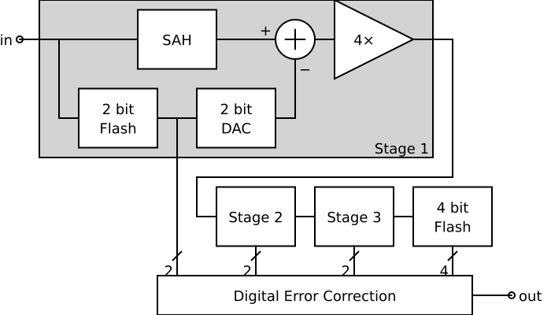
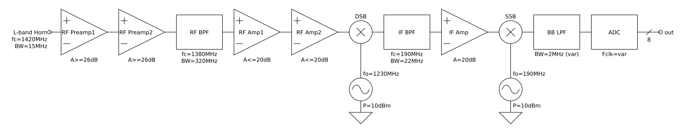

Examples
========

Charge Pump
-----------

This example absolute coordinates created by  *offsets_to_coordinates*. It has 
a transparent background and so all wires terminate at terminals rather than 
passing underneath components. The labels are intended to be rendered by Latex.

Inverter
--------

This example absolute coordinates created by  *offsets_to_coordinates*. It has 
a transparent background and so all wires terminate at terminals rather than 
passing underneath components. The labels are intended to be rendered by Latex.

Oscillator
----------

This example absolute coordinates created by  *offsets_to_coordinates*. It has 
a transparent background and so all wires terminate at terminals rather than 
passing underneath components. The labels are intended to be rendered by Latex.

Pipelined ADC
-------------

This example absolute coordinates created by  *offsets_to_coordinates*. It has 
a white background and so could route wires under components rather than wiring 
to terminals, but it largely does not.

Receiver
--------

This example relative coordinates. The only absolute coordinates given are for 
the input, and that is specified as the origin. It has a white background and so 
could route the wires underneath the components, but does not.

