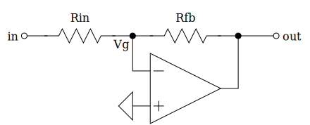
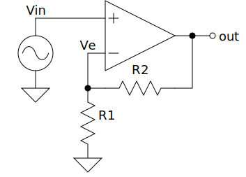
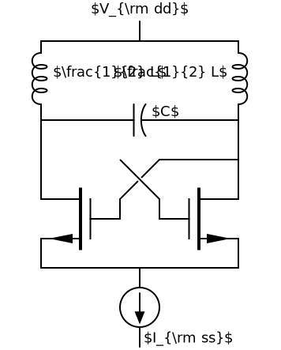
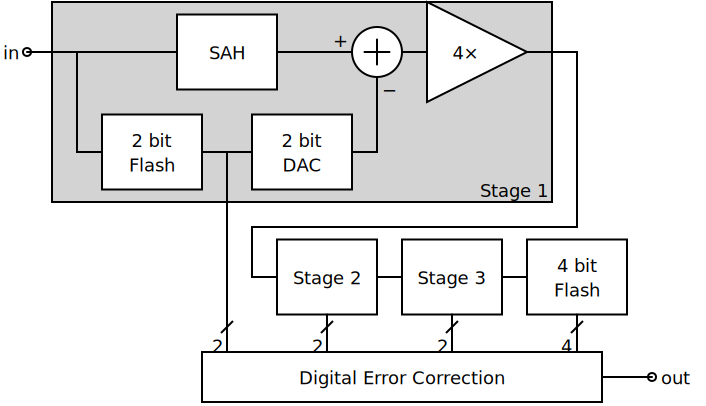

Examples
========

Charge Pump (charge-pump.py)
----------------------------

This example has a transparent background and so all wires terminate at 
terminals rather than passing underneath components. The labels are intended to 
be rendered by Latex.

.. include:: charge-pump.py
    :literal:

Inverter (inverter.py)
----------------------

This example has a transparent background and so all wires terminate at 
terminals rather than passing underneath components. The labels are intended to 
be rendered by Latex.

.. include:: inverter.py
    :literal:

Inverting Amplifier (inverting.py)
----------------------------------

.. include:: inverting.py
    :literal:

Non-Inverting Amplifier (noninverting.py)
-----------------------

.. include:: noninverting.py
    :literal:

Oscillator (oscillator.py)
--------------------------

This example has a transparent background and so all wires terminate at 
terminals rather than passing underneath components. The labels are intended to 
be rendered by Latex.

.. include:: oscillator.py
    :literal:

Passive Low Pass Filter (mfed.py)
~~~~~~~~~~~~~~~~~~~~~~~

This example uses `QuantiPhy 
<https://quantiphy.readthedocs.io/en/latest/index.html>`_ to compute the values 
for the components in a low pass filter and then constructs the schematic using 
those values.

.. include:: mfed.py
    :literal:

Pipelined ADC (pipeline-adc.py)
-------------------------------

This example has a white background and so could route wires under components 
rather than wiring to terminals, but it largely does not.

.. include:: pipeline-adc.py
    :literal:

Receiver (receiver.py)
----------------------

This example has a white background and so could route the wires underneath the 
components, but does not.

.. include:: receiver.py
    :literal:

